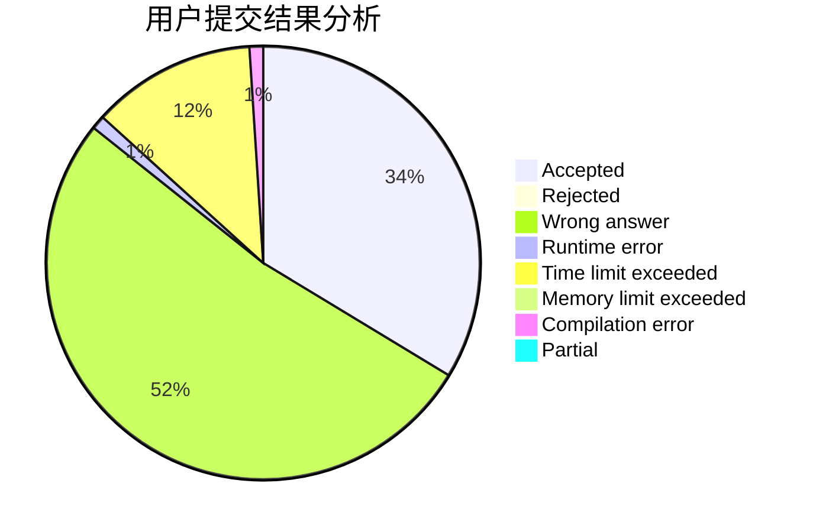
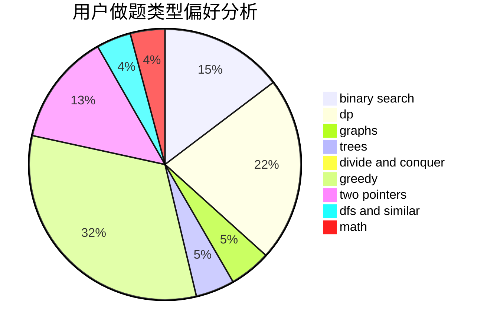

# sjc_van

<!-- tabs:start -->

#### **用户提交结果分析**

#### **用户做题类型偏好分析**

<!-- tabs:end -->
# 推荐题目
[1316B](https://codeforces.com/contest/1316/problem/B)
[519E](https://codeforces.com/contest/519/problem/E)
[603B](https://codeforces.com/contest/603/problem/B)
[1432F](https://codeforces.com/contest/1432/problem/F)
[1139A](https://codeforces.com/contest/1139/problem/A)
[864E](https://codeforces.com/contest/864/problem/E)
[608D](https://codeforces.com/contest/608/problem/D)
[888B](https://codeforces.com/contest/888/problem/B)
[521B](https://codeforces.com/contest/521/problem/B)
[868E](https://codeforces.com/contest/868/problem/E)
