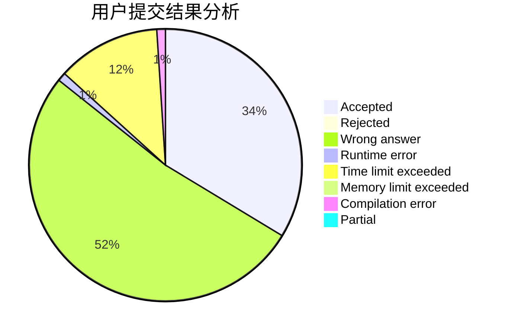
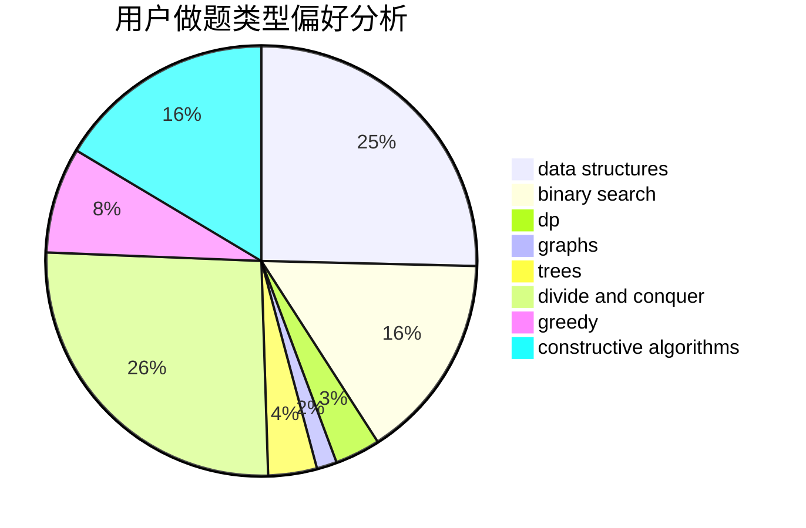

# sjc_van

<!-- tabs:start -->

#### **用户提交结果分析**

#### **用户做题类型偏好分析**

#### **用户错题知识点分析**

<!-- tabs:end -->
# 推荐题目
[1307F](https://codeforces.com/contest/1307/problem/F)		dfs and similar,
                        dsu,
                        trees		  
[498E](https://codeforces.com/contest/498/problem/E)		dp,
                        matrices		  
[582B](https://codeforces.com/contest/582/problem/B)		constructive algorithms,
                        dp,
                        matrices		  
[1424G](https://codeforces.com/contest/1424/problem/G)		data structures,
                        sortings		  
[1136E](https://codeforces.com/contest/1136/problem/E)		binary search,
                        data structures		  
[846C](https://codeforces.com/contest/846/problem/C)		brute force,
                        data structures,
                        dp		  
[588B](https://codeforces.com/contest/588/problem/B)		math		  
[868F](https://codeforces.com/contest/868/problem/F)		divide and conquer,
                        dp		  
[500B](https://codeforces.com/contest/500/problem/B)		dfs and similar,
                        dsu,
                        graphs,
                        greedy,
                        math,
                        sortings		  
[84A](https://codeforces.com/contest/84/problem/A)		math,
                        number theory		  
