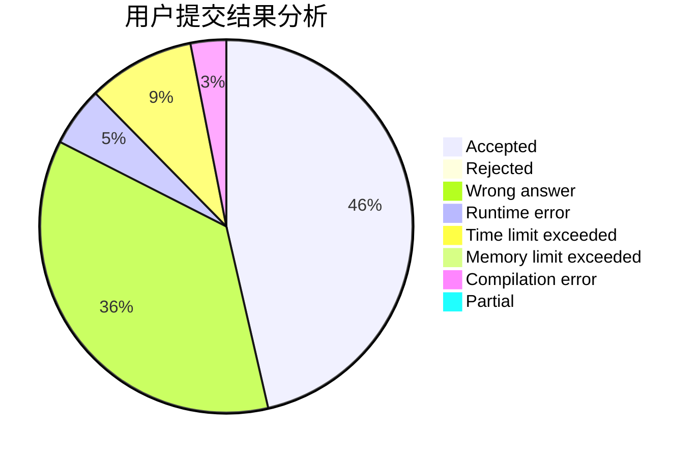
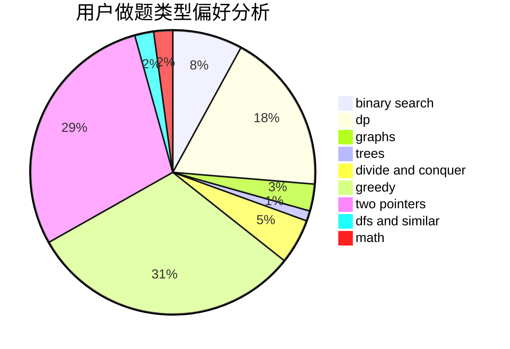

# sjtuzlp

<!-- tabs:start -->

#### **用户提交结果分析**

#### **用户做题类型偏好分析**

<!-- tabs:end -->
# 推荐题目
[1771](https://codeforces.com/contest/177/problem/1)
[578B](https://codeforces.com/contest/578/problem/B)
[323C](https://codeforces.com/contest/323/problem/C)
[190E](https://codeforces.com/contest/190/problem/E)
[843B](https://codeforces.com/contest/843/problem/B)
[722C](https://codeforces.com/contest/722/problem/C)
[34C](https://codeforces.com/contest/34/problem/C)
[1103D](https://codeforces.com/contest/1103/problem/D)
[696D](https://codeforces.com/contest/696/problem/D)
[650D](https://codeforces.com/contest/650/problem/D)
