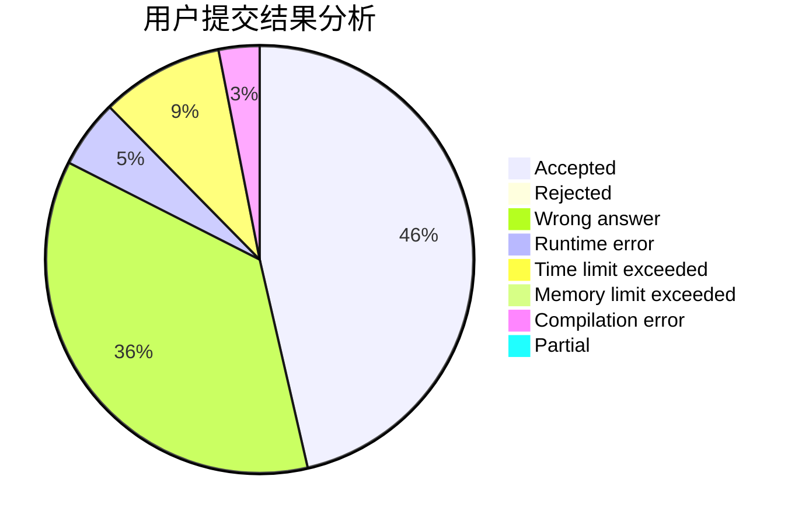
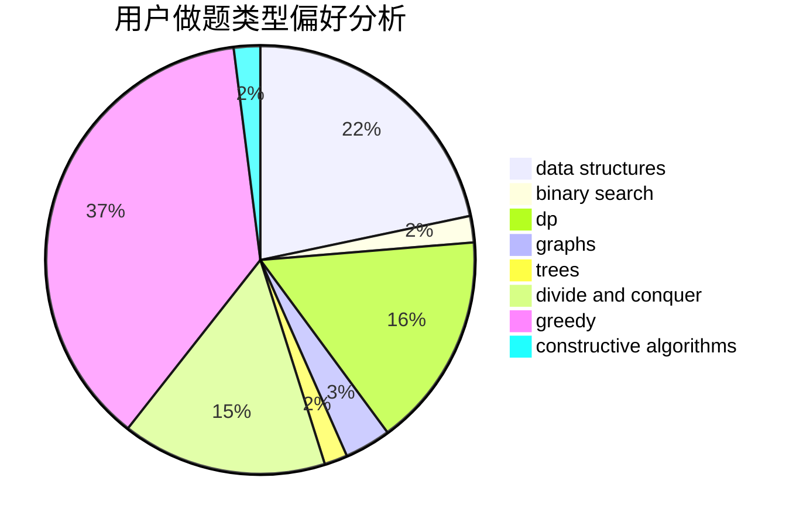
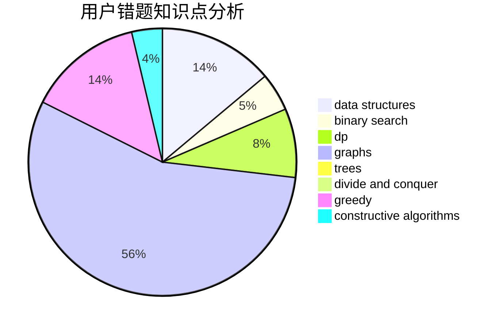

# sjtuzlp

<!-- tabs:start -->

#### **用户提交结果分析**

#### **用户做题类型偏好分析**

#### **用户错题知识点分析**

<!-- tabs:end -->
# 推荐题目
[1771](https://codeforces.com/contest/177/problem/1)		dsu,graphs,sortings,trees		  
[578B](https://codeforces.com/contest/578/problem/B)		brute force,
                        greedy		  
[323C](https://codeforces.com/contest/323/problem/C)		data structures		  
[190E](https://codeforces.com/contest/190/problem/E)		data structures,
                        dsu,
                        graphs,
                        hashing,
                        sortings		  
[843B](https://codeforces.com/contest/843/problem/B)		brute force,
                        interactive,
                        probabilities		  
[722C](https://codeforces.com/contest/722/problem/C)		data structures,
                        dsu		  
[34C](https://codeforces.com/contest/34/problem/C)		expression parsing,
                        implementation,
                        sortings,
                        strings		  
[1103D](https://codeforces.com/contest/1103/problem/D)		bitmasks,
                        dp		  
[696D](https://codeforces.com/contest/696/problem/D)		data structures,
                        dp,
                        matrices,
                        strings		  
[650D](https://codeforces.com/contest/650/problem/D)		binary search,
                        data structures,
                        dp,
                        hashing		  
