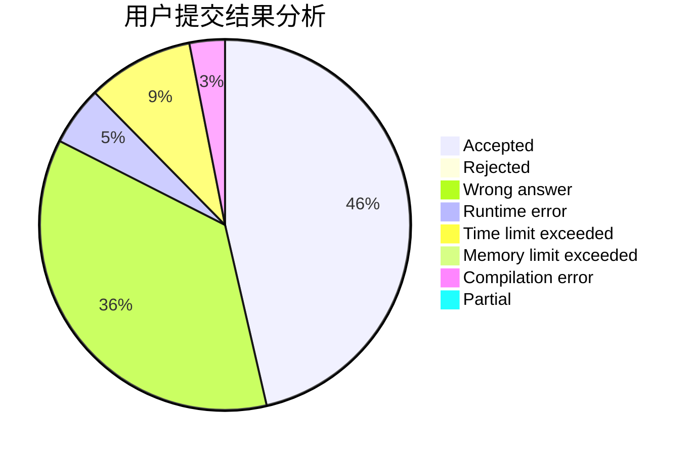
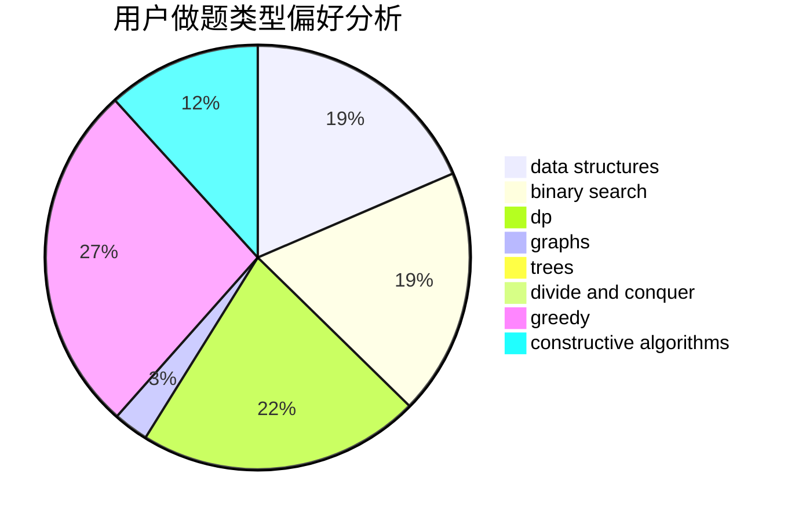
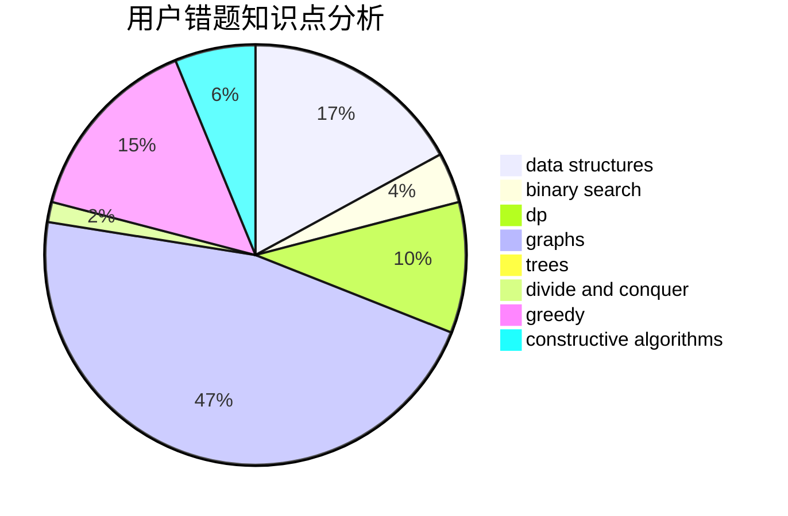

# sjtuzlp

<!-- tabs:start -->

#### **用户提交结果分析**

#### **用户做题类型偏好分析**

#### **用户错题知识点分析**

<!-- tabs:end -->
# 推荐题目
[156C](https://codeforces.com/contest/156/problem/C)		combinatorics,
                        dp		  
[552E](https://codeforces.com/contest/552/problem/E)		brute force,
                        dp,
                        expression parsing,
                        greedy,
                        implementation,
                        strings		  
[304B](https://codeforces.com/contest/304/problem/B)		brute force,
                        implementation		  
[165E](https://codeforces.com/contest/165/problem/E)		bitmasks,
                        brute force,
                        dfs and similar,
                        dp		  
[825B](https://codeforces.com/contest/825/problem/B)		brute force,
                        implementation		  
[703B](https://codeforces.com/contest/703/problem/B)		implementation,
                        math		  
[319C](https://codeforces.com/contest/319/problem/C)		dp,
                        geometry		  
[1103A](https://codeforces.com/contest/1103/problem/A)		constructive algorithms,
                        implementation		  
[670F](https://codeforces.com/contest/670/problem/F)		brute force,
                        constructive algorithms,
                        strings		  
[622D](https://codeforces.com/contest/622/problem/D)		constructive algorithms		  
