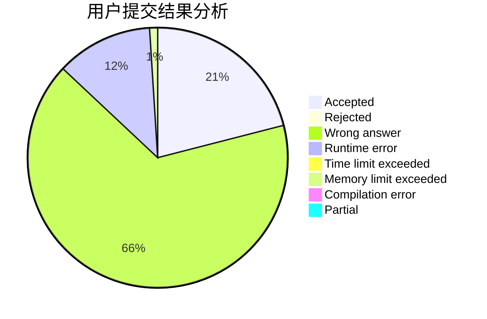
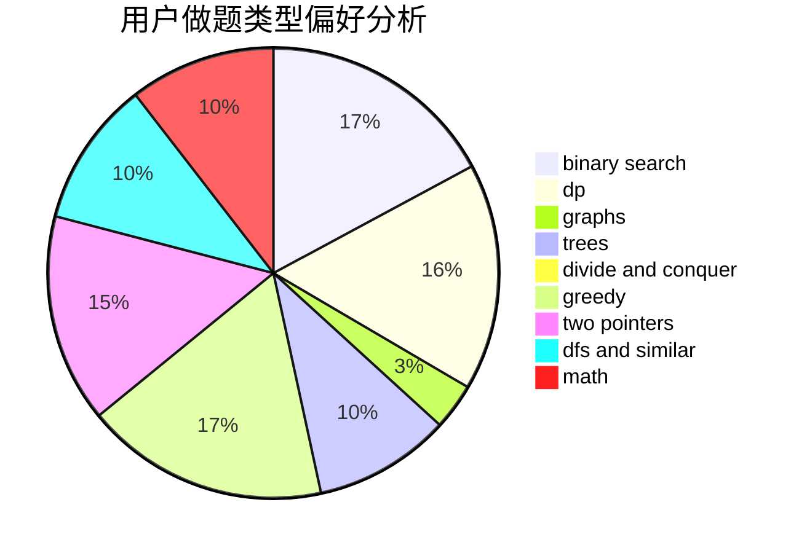

# skip2004

<!-- tabs:start -->

#### **用户提交结果分析**

#### **用户做题类型偏好分析**

<!-- tabs:end -->
# 推荐题目
[908B](https://codeforces.com/contest/908/problem/B)
[1465F](https://codeforces.com/contest/1465/problem/F)
[441D](https://codeforces.com/contest/441/problem/D)
[585B](https://codeforces.com/contest/585/problem/B)
[288E](https://codeforces.com/contest/288/problem/E)
[279A](https://codeforces.com/contest/279/problem/A)
[576C](https://codeforces.com/contest/576/problem/C)
[1200D](https://codeforces.com/contest/1200/problem/D)
[845D](https://codeforces.com/contest/845/problem/D)
[660B](https://codeforces.com/contest/660/problem/B)
