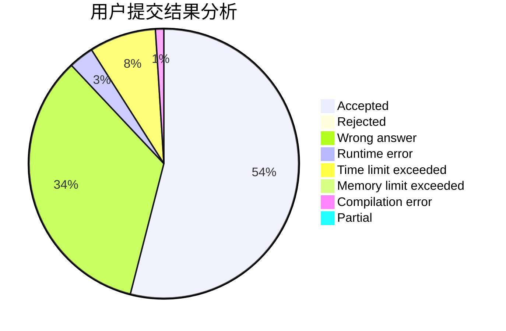
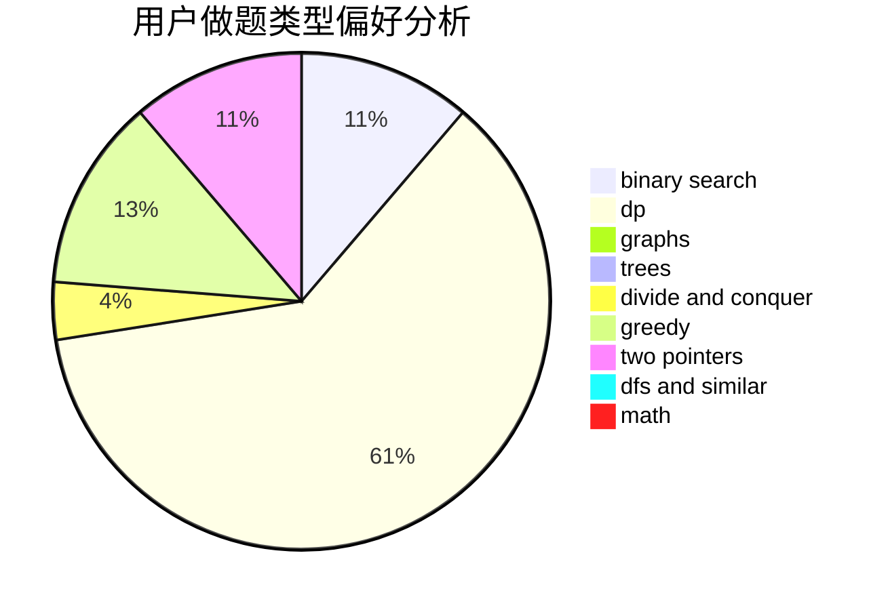

# sky123

<!-- tabs:start -->

#### **用户提交结果分析**

#### **用户做题类型偏好分析**

<!-- tabs:end -->
# 推荐题目
[36C](https://codeforces.com/contest/36/problem/C)
[1151D](https://codeforces.com/contest/1151/problem/D)
[837D](https://codeforces.com/contest/837/problem/D)
[345A](https://codeforces.com/contest/345/problem/A)
[68A](https://codeforces.com/contest/68/problem/A)
[466C](https://codeforces.com/contest/466/problem/C)
[480B](https://codeforces.com/contest/480/problem/B)
[303A](https://codeforces.com/contest/303/problem/A)
[763B](https://codeforces.com/contest/763/problem/B)
[784B](https://codeforces.com/contest/784/problem/B)
