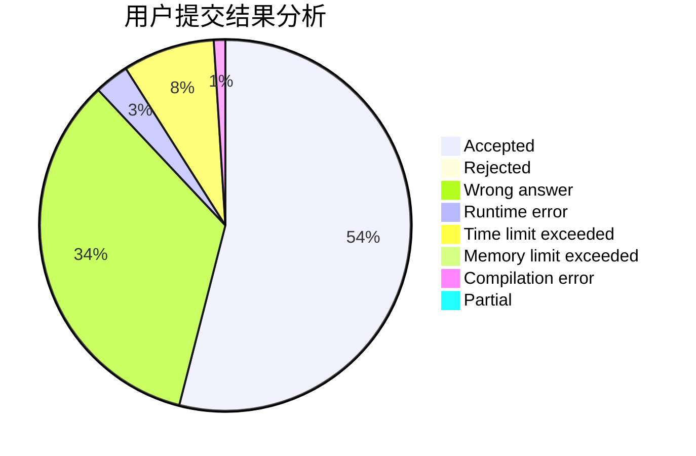
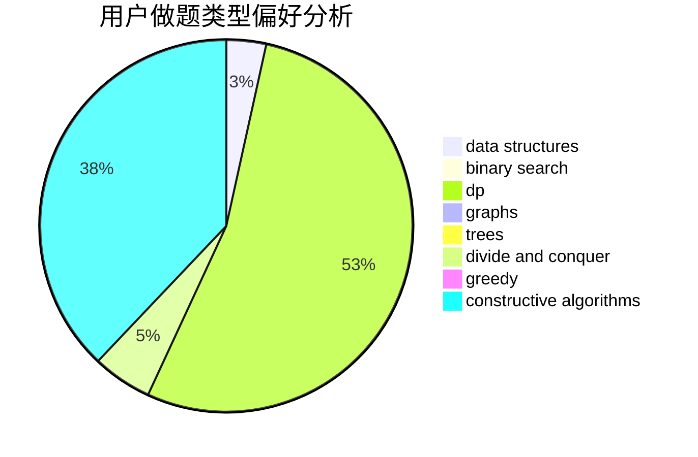
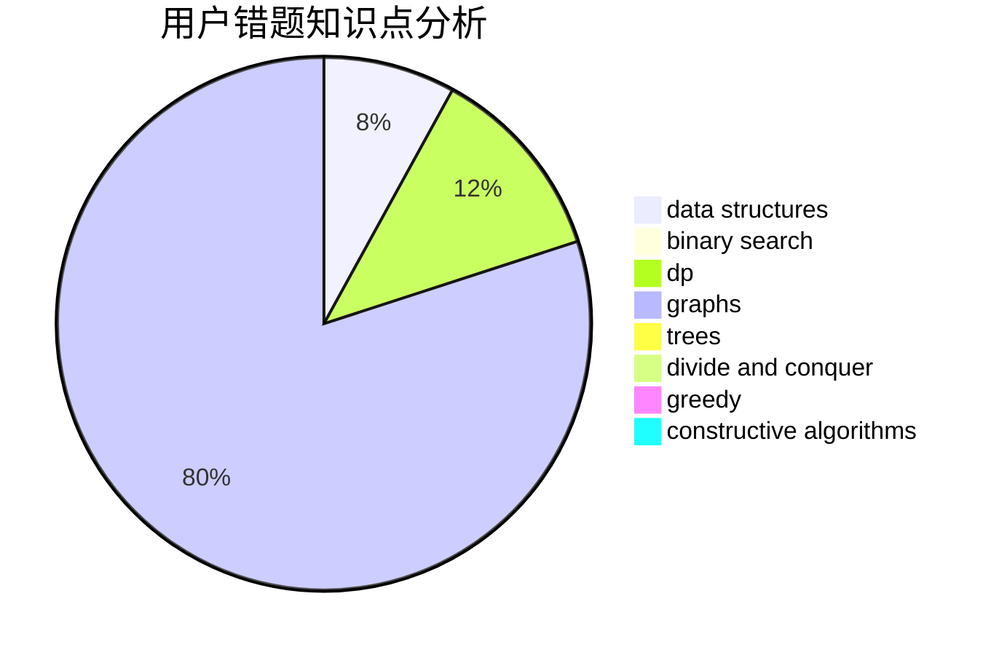

# sky123

<!-- tabs:start -->

#### **用户提交结果分析**

#### **用户做题类型偏好分析**

#### **用户错题知识点分析**

<!-- tabs:end -->
# 推荐题目
[36C](https://codeforces.com/contest/36/problem/C)		geometry,
                        implementation		  
[1151D](https://codeforces.com/contest/1151/problem/D)		greedy,
                        math,
                        sortings		  
[837D](https://codeforces.com/contest/837/problem/D)		dp,
                        math		  
[345A](https://codeforces.com/contest/345/problem/A)		*special problem,
                        probabilities		  
[68A](https://codeforces.com/contest/68/problem/A)		implementation,
                        number theory		  
[466C](https://codeforces.com/contest/466/problem/C)		binary search,
                        brute force,
                        data structures,
                        dp,
                        two pointers		  
[480B](https://codeforces.com/contest/480/problem/B)		dsu,graphs,sortings,trees		  
[303A](https://codeforces.com/contest/303/problem/A)		constructive algorithms,
                        implementation,
                        math		  
[763B](https://codeforces.com/contest/763/problem/B)		constructive algorithms,
                        geometry		  
[784B](https://codeforces.com/contest/784/problem/B)		*special problem		  
