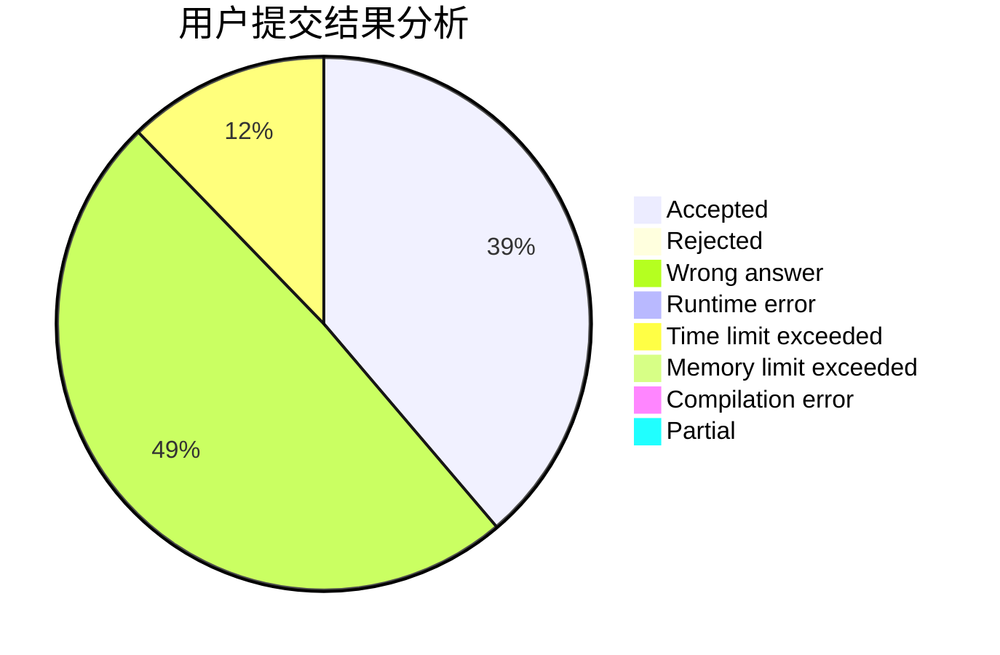
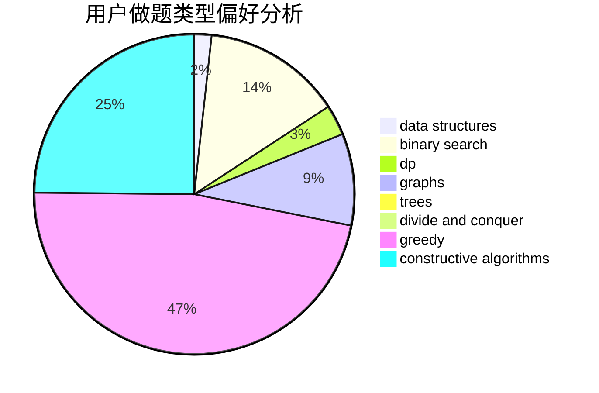
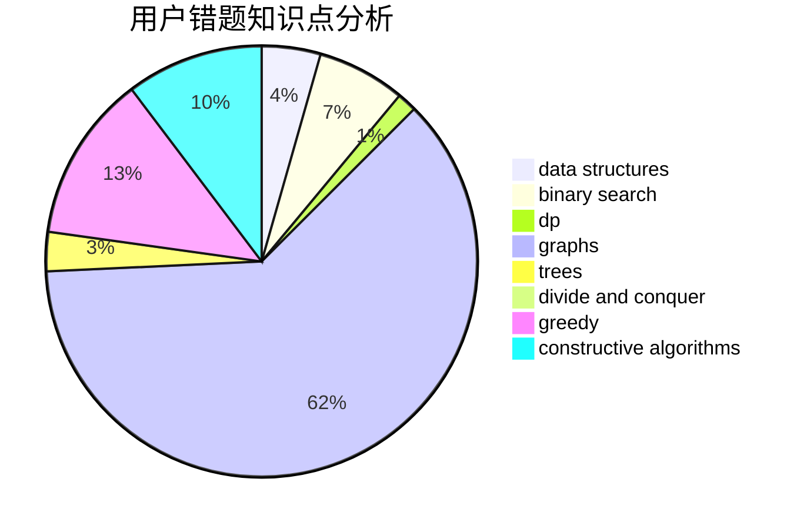

# skyRin

<!-- tabs:start -->

#### **用户提交结果分析**

#### **用户做题类型偏好分析**

#### **用户错题知识点分析**

<!-- tabs:end -->
# 推荐题目
[592C](https://codeforces.com/contest/592/problem/C)		math		  
[1236A](https://codeforces.com/contest/1236/problem/A)		brute force,
                        greedy,
                        math		  
[718D](https://codeforces.com/contest/718/problem/D)		dp,
                        hashing,
                        trees		  
[13932](https://codeforces.com/contest/1393/problem/2)		dsu,graphs,sortings,trees		  
[803B](https://codeforces.com/contest/803/problem/B)		constructive algorithms		  
[991A](https://codeforces.com/contest/991/problem/A)		implementation		  
[1186C](https://codeforces.com/contest/1186/problem/C)		implementation,
                        math		  
[1055B](https://codeforces.com/contest/1055/problem/B)		dsu,
                        implementation		  
[11291](https://codeforces.com/contest/1129/problem/1)		dsu,graphs,sortings,trees		  
[978B](https://codeforces.com/contest/978/problem/B)		greedy,
                        strings		  
