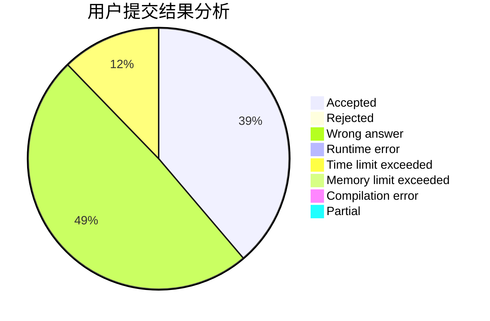
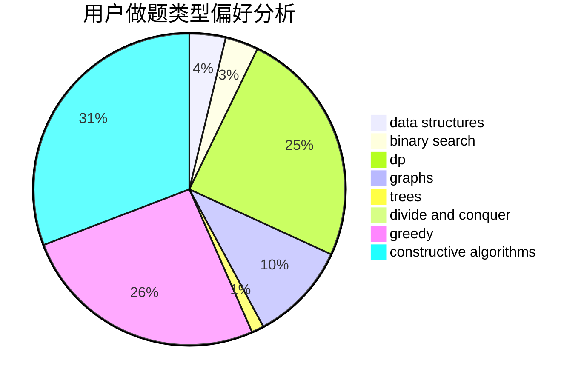
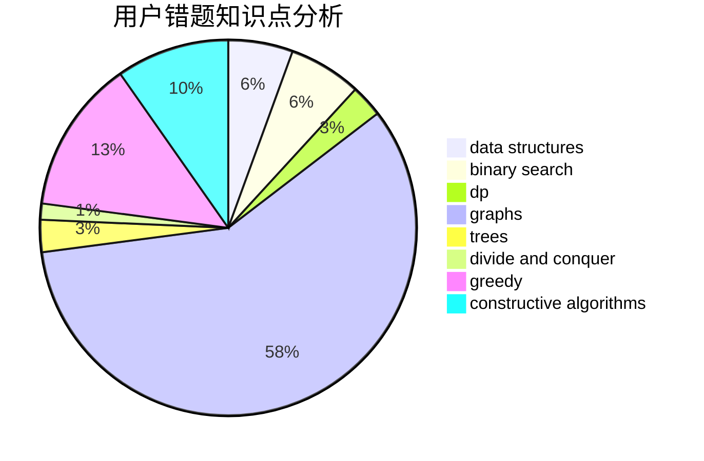

# skyRin

<!-- tabs:start -->

#### **用户提交结果分析**

#### **用户做题类型偏好分析**

#### **用户错题知识点分析**

<!-- tabs:end -->
# 推荐题目
[572A](https://codeforces.com/contest/572/problem/A)		sortings		  
[1227D1](https://codeforces.com/contest/1227D/problem/1)		data structures,
                        greedy		  
[700C](https://codeforces.com/contest/700/problem/C)		dfs and similar,
                        graphs		  
[1383C](https://codeforces.com/contest/1383/problem/C)		bitmasks,
                        dp,
                        graphs,
                        trees		  
[787A](https://codeforces.com/contest/787/problem/A)		brute force,
                        math,
                        number theory		  
[977C](https://codeforces.com/contest/977/problem/C)		sortings		  
[1183E](https://codeforces.com/contest/1183/problem/E)		dp,
                        graphs,
                        implementation,
                        shortest paths		  
[1054G](https://codeforces.com/contest/1054/problem/G)		constructive algorithms,
                        greedy,
                        math		  
[1119D](https://codeforces.com/contest/1119/problem/D)		binary search,
                        sortings		  
[956D](https://codeforces.com/contest/956/problem/D)		dsu,graphs,sortings,trees		  
