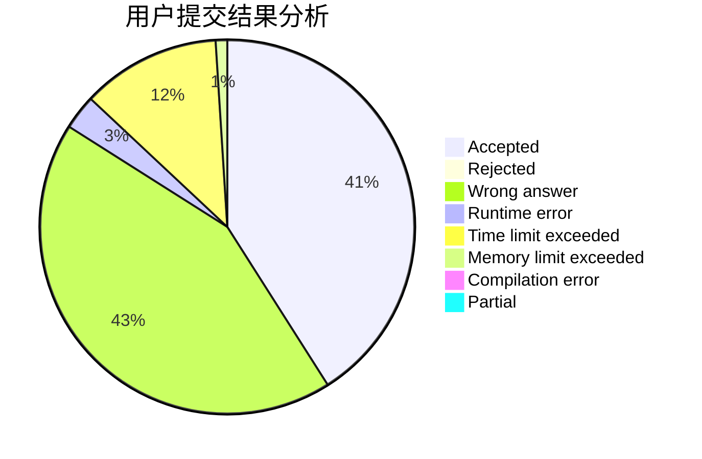
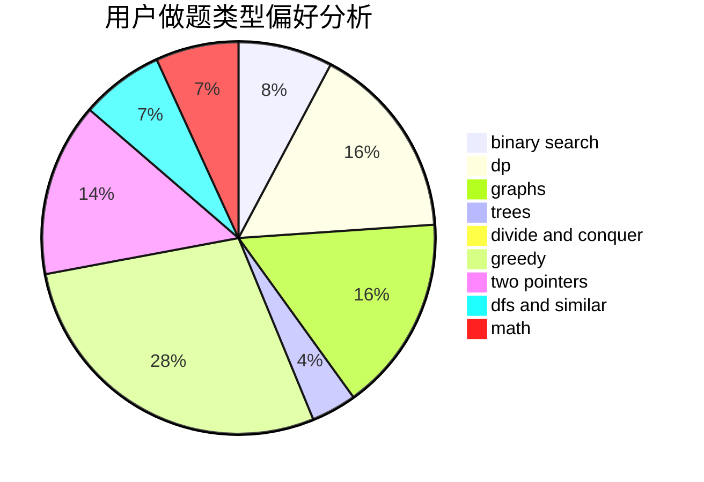

# sky_limits

<!-- tabs:start -->

#### **用户提交结果分析**

#### **用户做题类型偏好分析**

<!-- tabs:end -->
# 推荐题目
[14791](https://codeforces.com/contest/1479/problem/1)
[1482D](https://codeforces.com/contest/1482/problem/D)
[1205E](https://codeforces.com/contest/1205/problem/E)
[174B](https://codeforces.com/contest/174/problem/B)
[13932](https://codeforces.com/contest/1393/problem/2)
[840D](https://codeforces.com/contest/840/problem/D)
[6701](https://codeforces.com/contest/670/problem/1)
[802D](https://codeforces.com/contest/802/problem/D)
[875A](https://codeforces.com/contest/875/problem/A)
[1031A](https://codeforces.com/contest/1031/problem/A)
