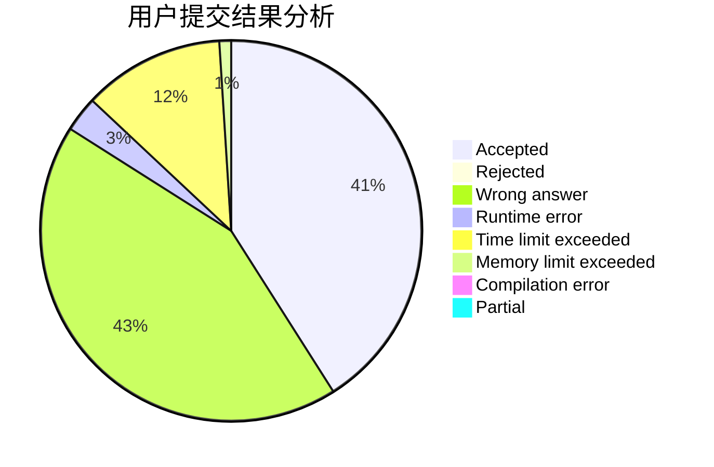
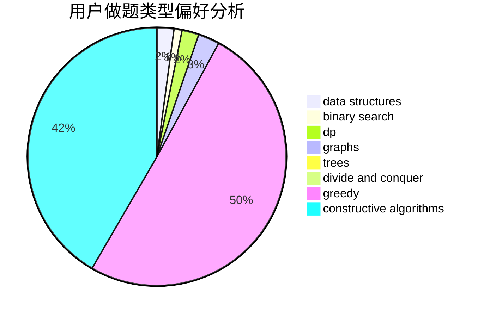
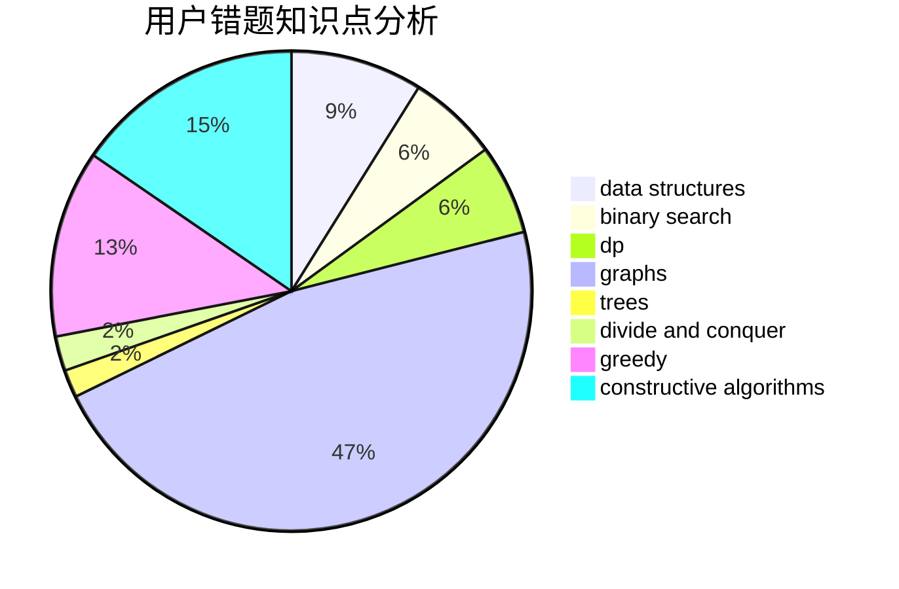

# sky_limits

<!-- tabs:start -->

#### **用户提交结果分析**

#### **用户做题类型偏好分析**

#### **用户错题知识点分析**

<!-- tabs:end -->
# 推荐题目
[1470D](https://codeforces.com/contest/1470/problem/D)		constructive algorithms,
                        dfs and similar,
                        graph matchings,
                        graphs,
                        greedy		  
[1473G](https://codeforces.com/contest/1473/problem/G)		combinatorics,
                        dp,
                        fft,
                        math		  
[1201A](https://codeforces.com/contest/1201/problem/A)		implementation,
                        strings		  
[1513F](https://codeforces.com/contest/1513/problem/F)		brute force,
                        constructive algorithms,
                        data structures,
                        sortings		  
[1383C](https://codeforces.com/contest/1383/problem/C)		bitmasks,
                        dp,
                        graphs,
                        trees		  
[820D](https://codeforces.com/contest/820/problem/D)		dsu,graphs,sortings,trees		  
[63C](https://codeforces.com/contest/63/problem/C)		brute force,
                        implementation		  
[785A](https://codeforces.com/contest/785/problem/A)		implementation,
                        strings		  
[855F](https://codeforces.com/contest/855/problem/F)		binary search,
                        data structures		  
[1030D](https://codeforces.com/contest/1030/problem/D)		geometry,
                        number theory		  
