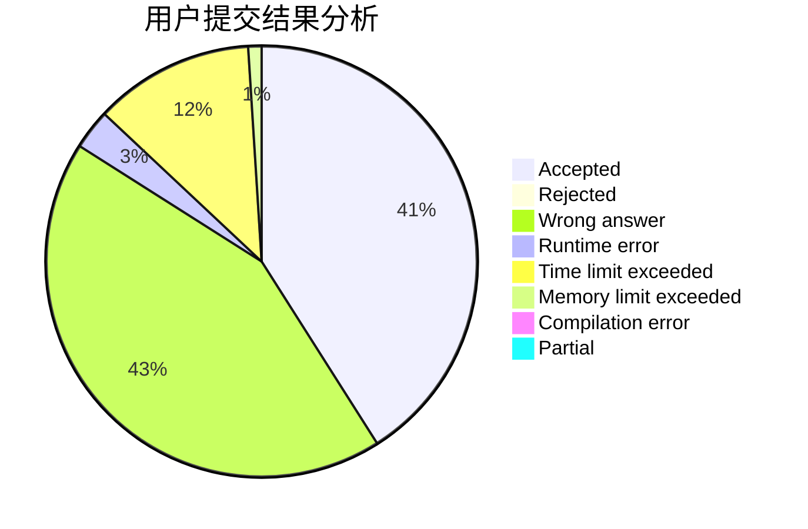
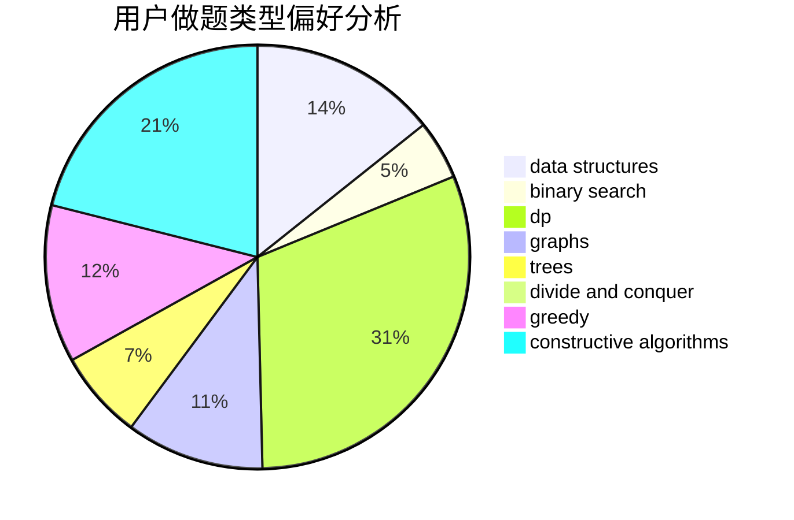
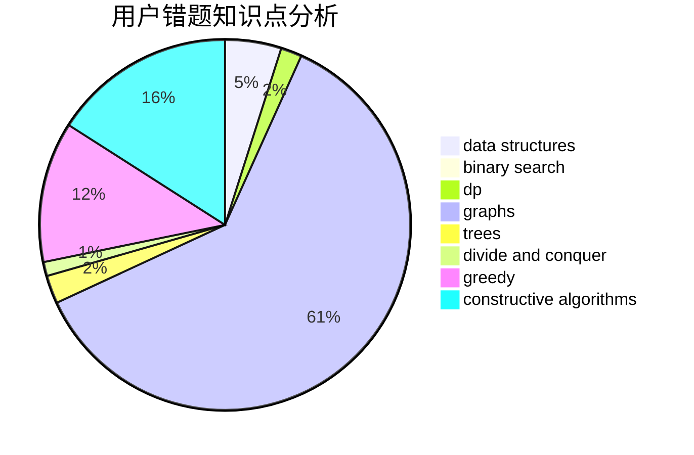

# sky_limits

<!-- tabs:start -->

#### **用户提交结果分析**

#### **用户做题类型偏好分析**

#### **用户错题知识点分析**

<!-- tabs:end -->
# 推荐题目
[14791](https://codeforces.com/contest/1479/problem/1)		dsu,graphs,sortings,trees		  
[1482D](https://codeforces.com/contest/1482/problem/D)		data structures,
                        dsu,
                        implementation,
                        shortest paths		  
[1205E](https://codeforces.com/contest/1205/problem/E)		combinatorics,
                        strings		  
[174B](https://codeforces.com/contest/174/problem/B)		dp,
                        greedy,
                        implementation		  
[13932](https://codeforces.com/contest/1393/problem/2)		dsu,graphs,sortings,trees		  
[840D](https://codeforces.com/contest/840/problem/D)		data structures,
                        probabilities		  
[6701](https://codeforces.com/contest/670/problem/1)		dsu,graphs,sortings,trees		  
[802D](https://codeforces.com/contest/802/problem/D)		math		  
[875A](https://codeforces.com/contest/875/problem/A)		brute force,
                        math		  
[1031A](https://codeforces.com/contest/1031/problem/A)		implementation,
                        math		  
