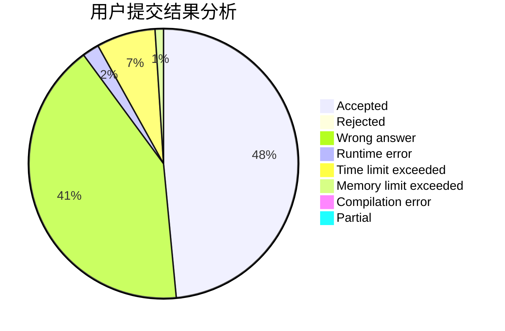
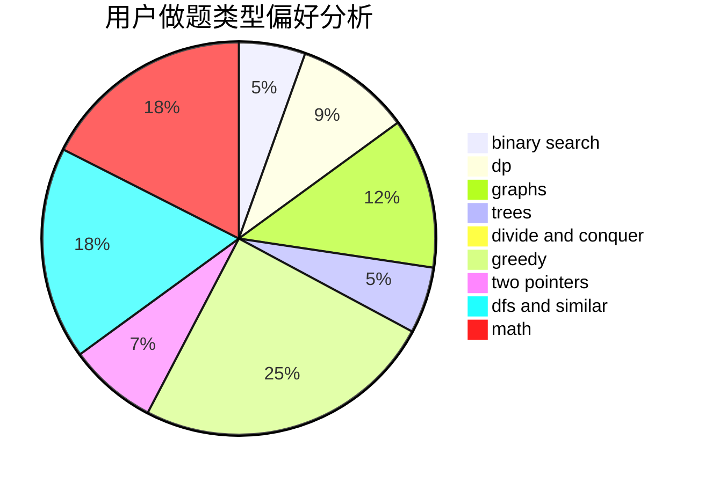

# skydog

<!-- tabs:start -->

#### **用户提交结果分析**

#### **用户做题类型偏好分析**

<!-- tabs:end -->
# 推荐题目
[916D](https://codeforces.com/contest/916/problem/D)
[1065F](https://codeforces.com/contest/1065/problem/F)
[1093C](https://codeforces.com/contest/1093/problem/C)
[364C](https://codeforces.com/contest/364/problem/C)
[283B](https://codeforces.com/contest/283/problem/B)
[712C](https://codeforces.com/contest/712/problem/C)
[762B](https://codeforces.com/contest/762/problem/B)
[575B](https://codeforces.com/contest/575/problem/B)
[1039E](https://codeforces.com/contest/1039/problem/E)
[553D](https://codeforces.com/contest/553/problem/D)
