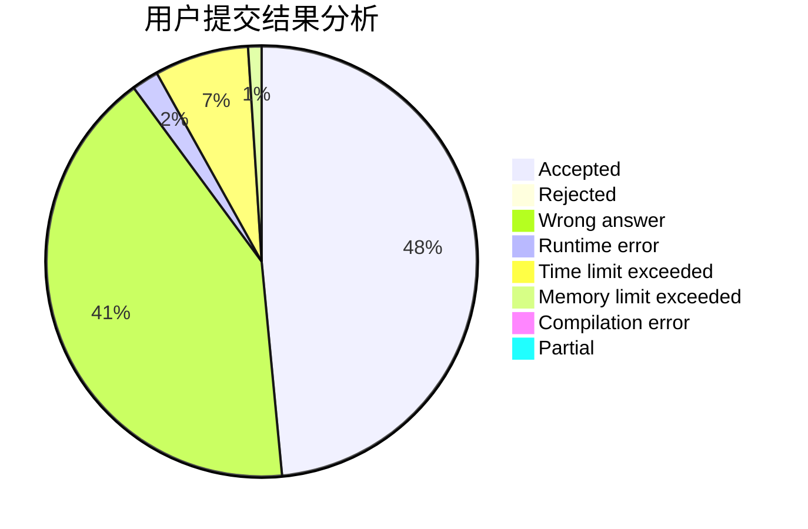
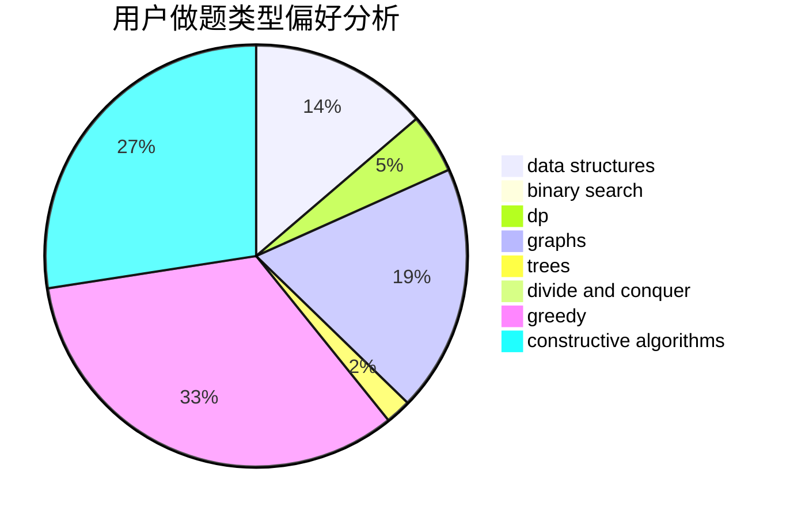

# skydog

<!-- tabs:start -->

#### **用户提交结果分析**

#### **用户做题类型偏好分析**

#### **用户错题知识点分析**

<!-- tabs:end -->
# 推荐题目
[916D](https://codeforces.com/contest/916/problem/D)		data structures,
                        interactive,
                        trees		  
[1065F](https://codeforces.com/contest/1065/problem/F)		dfs and similar,
                        dp,
                        trees		  
[1093C](https://codeforces.com/contest/1093/problem/C)		greedy		  
[364C](https://codeforces.com/contest/364/problem/C)		brute force,
                        number theory		  
[283B](https://codeforces.com/contest/283/problem/B)		dfs and similar,
                        dp,
                        graphs		  
[712C](https://codeforces.com/contest/712/problem/C)		greedy,
                        math		  
[762B](https://codeforces.com/contest/762/problem/B)		greedy,
                        implementation,
                        sortings,
                        two pointers		  
[575B](https://codeforces.com/contest/575/problem/B)		dfs and similar,
                        graphs,
                        trees		  
[1039E](https://codeforces.com/contest/1039/problem/E)		data structures		  
[553D](https://codeforces.com/contest/553/problem/D)		binary search,
                        graphs,
                        greedy		  
