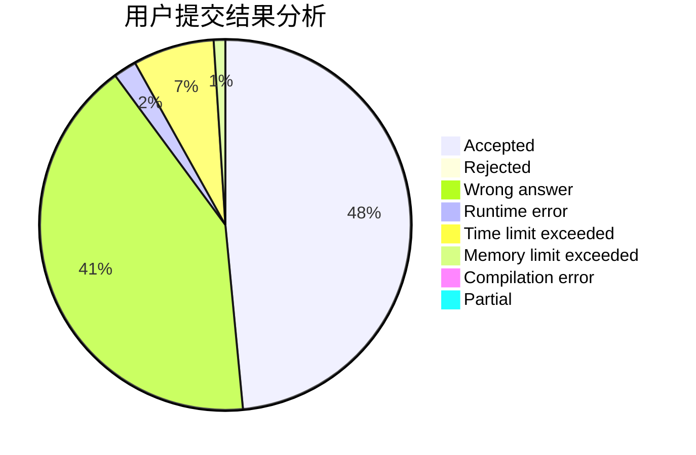
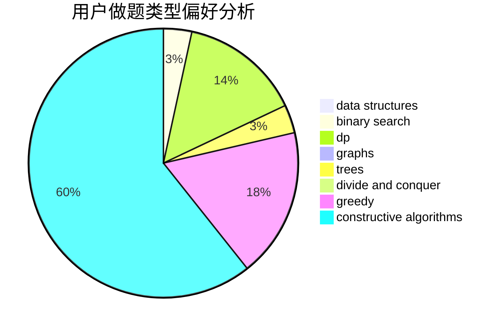

# skydog

<!-- tabs:start -->

#### **用户提交结果分析**

#### **用户做题类型偏好分析**

#### **用户错题知识点分析**

<!-- tabs:end -->
# 推荐题目
[900A](https://codeforces.com/contest/900/problem/A)		geometry,
                        implementation		  
[1065B](https://codeforces.com/contest/1065/problem/B)		constructive algorithms,
                        graphs		  
[1092F](https://codeforces.com/contest/1092/problem/F)		dfs and similar,
                        dp,
                        trees		  
[338D](https://codeforces.com/contest/338/problem/D)		chinese remainder theorem,
                        math,
                        number theory		  
[268A](https://codeforces.com/contest/268/problem/A)		brute force		  
[696A](https://codeforces.com/contest/696/problem/A)		brute force,
                        data structures,
                        implementation,
                        trees		  
[741B](https://codeforces.com/contest/741/problem/B)		dfs and similar,
                        dp,
                        dsu		  
[54B](https://codeforces.com/contest/54/problem/B)		hashing,
                        implementation		  
[1039B](https://codeforces.com/contest/1039/problem/B)		binary search,
                        interactive,
                        probabilities		  
[52C](https://codeforces.com/contest/52/problem/C)		data structures		  
