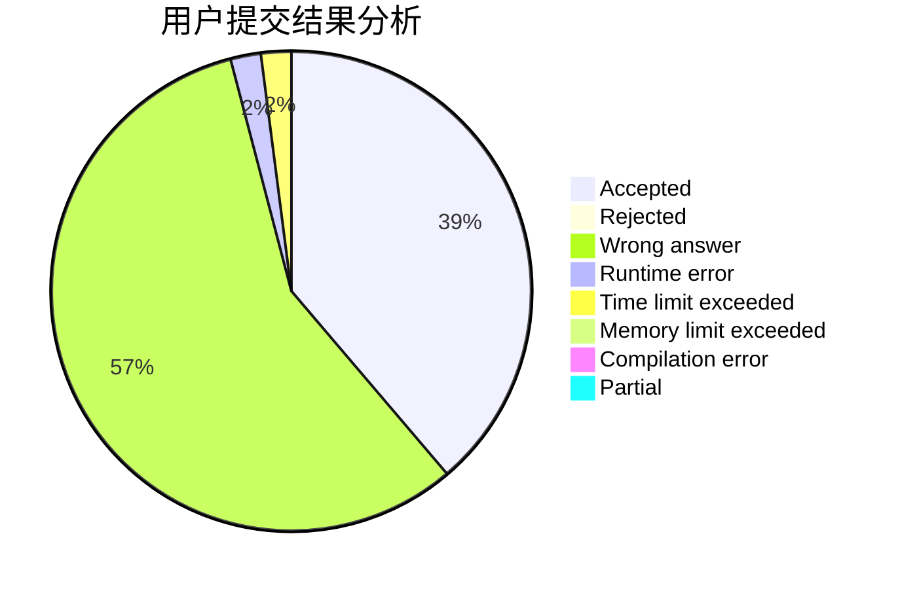
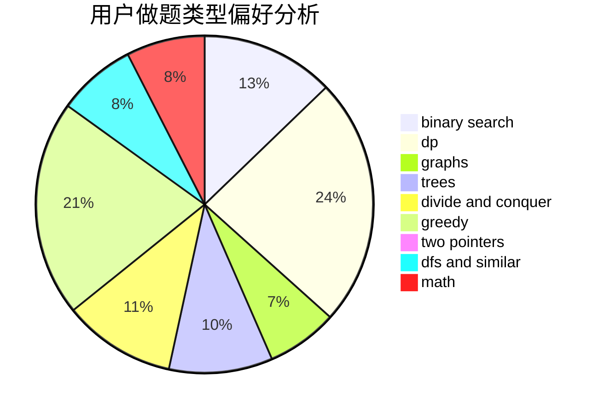

# skydogli

<!-- tabs:start -->

#### **用户提交结果分析**

#### **用户做题类型偏好分析**

<!-- tabs:end -->
# 推荐题目
[1446C](https://codeforces.com/contest/1446/problem/C)
[467A](https://codeforces.com/contest/467/problem/A)
[448B](https://codeforces.com/contest/448/problem/B)
[870B](https://codeforces.com/contest/870/problem/B)
[617B](https://codeforces.com/contest/617/problem/B)
[1413D](https://codeforces.com/contest/1413/problem/D)
[680B](https://codeforces.com/contest/680/problem/B)
[215C](https://codeforces.com/contest/215/problem/C)
[749A](https://codeforces.com/contest/749/problem/A)
[1062D](https://codeforces.com/contest/1062/problem/D)
