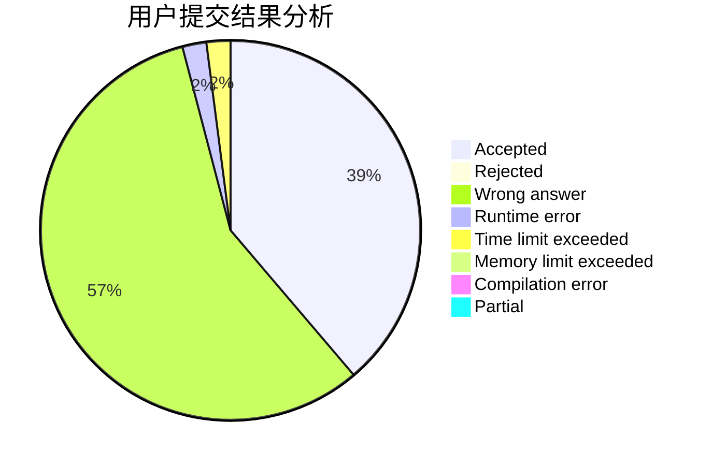
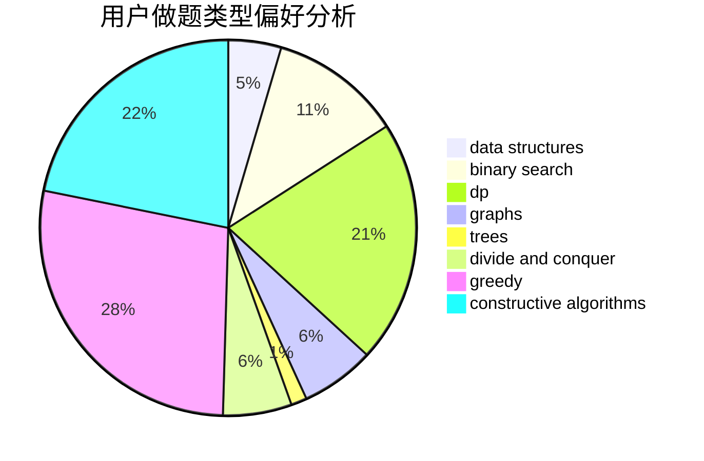
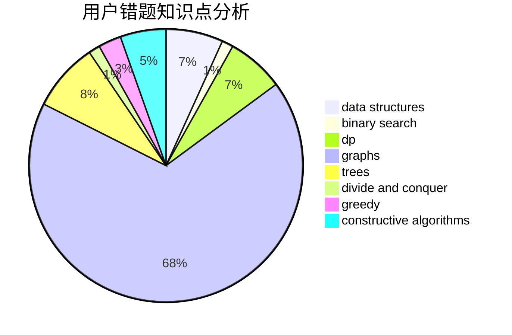

# skydogli

<!-- tabs:start -->

#### **用户提交结果分析**

#### **用户做题类型偏好分析**

#### **用户错题知识点分析**

<!-- tabs:end -->
# 推荐题目
[1446C](https://codeforces.com/contest/1446/problem/C)		binary search,
                        bitmasks,
                        data structures,
                        divide and conquer,
                        dp,
                        trees		  
[467A](https://codeforces.com/contest/467/problem/A)		implementation		  
[448B](https://codeforces.com/contest/448/problem/B)		implementation,
                        strings		  
[870B](https://codeforces.com/contest/870/problem/B)		greedy		  
[617B](https://codeforces.com/contest/617/problem/B)		combinatorics		  
[1413D](https://codeforces.com/contest/1413/problem/D)		data structures,
                        greedy,
                        implementation		  
[680B](https://codeforces.com/contest/680/problem/B)		constructive algorithms,
                        implementation		  
[215C](https://codeforces.com/contest/215/problem/C)		brute force,
                        implementation		  
[749A](https://codeforces.com/contest/749/problem/A)		greedy,
                        implementation,
                        math,
                        number theory		  
[1062D](https://codeforces.com/contest/1062/problem/D)		dfs and similar,
                        graphs,
                        implementation,
                        math		  
