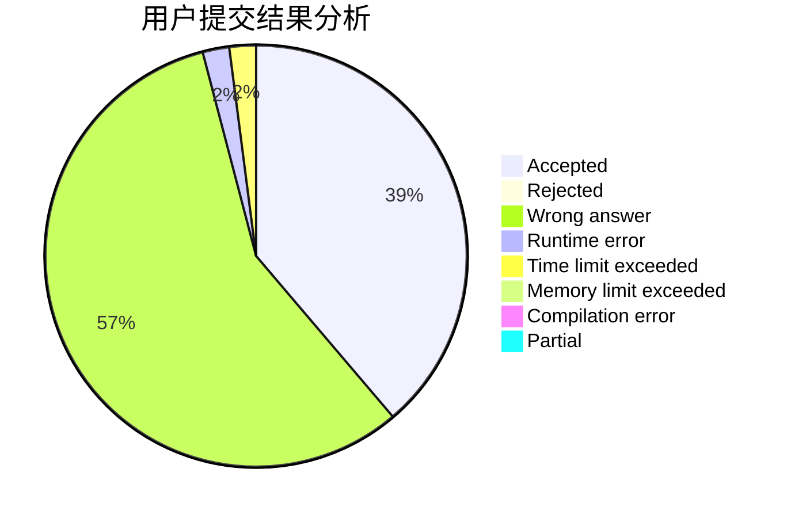
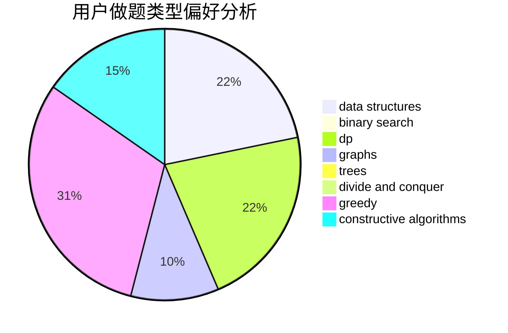
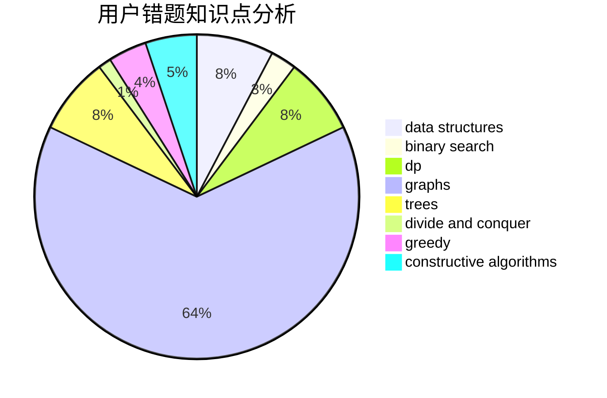

# skydogli

<!-- tabs:start -->

#### **用户提交结果分析**

#### **用户做题类型偏好分析**

#### **用户错题知识点分析**

<!-- tabs:end -->
# 推荐题目
[1436E](https://codeforces.com/contest/1436/problem/E)		binary search,
                        data structures,
                        two pointers		  
[446E](https://codeforces.com/contest/446/problem/E)		math,
                        matrices		  
[424E](https://codeforces.com/contest/424/problem/E)		dfs and similar,
                        dp,
                        probabilities		  
[852A](https://codeforces.com/contest/852/problem/A)		brute force,
                        implementation,
                        math		  
[599C](https://codeforces.com/contest/599/problem/C)		sortings		  
[1402B](https://codeforces.com/contest/1402/problem/B)		*special problem,
                        geometry,
                        sortings		  
[660A](https://codeforces.com/contest/660/problem/A)		greedy,
                        implementation,
                        math,
                        number theory		  
[18E](https://codeforces.com/contest/18/problem/E)		dp		  
[730J](https://codeforces.com/contest/730/problem/J)		dp		  
[1062A](https://codeforces.com/contest/1062/problem/A)		greedy,
                        implementation		  
