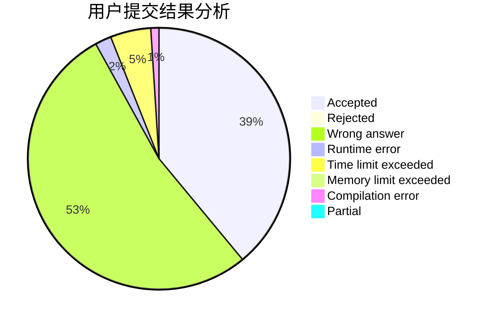
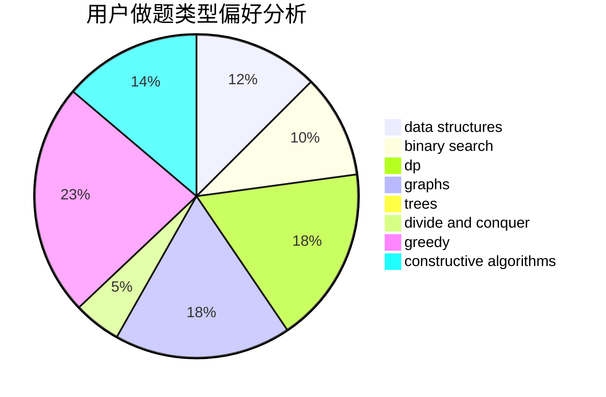
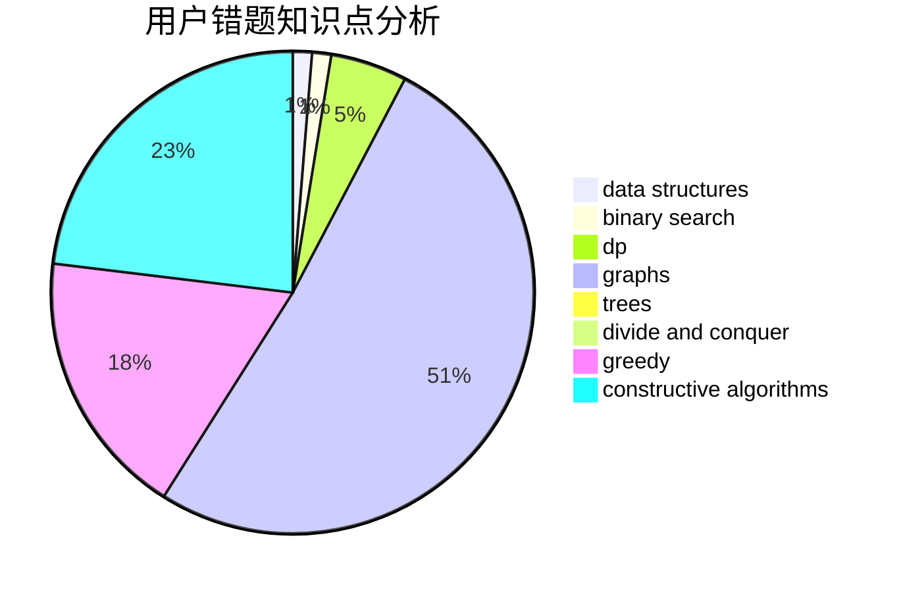

# skyh

<!-- tabs:start -->

#### **用户提交结果分析**

#### **用户做题类型偏好分析**

#### **用户错题知识点分析**

<!-- tabs:end -->
# 推荐题目
[1428G2](https://codeforces.com/contest/1428G/problem/2)		dp,
                        greedy		  
[979C](https://codeforces.com/contest/979/problem/C)		dfs and similar,
                        trees		  
[924D](https://codeforces.com/contest/924/problem/D)		nan		  
[1482B](https://codeforces.com/contest/1482/problem/B)		implementation,
                        math		  
[1091G](https://codeforces.com/contest/1091/problem/G)		interactive,
                        math,
                        number theory		  
[449B](https://codeforces.com/contest/449/problem/B)		graphs,
                        greedy,
                        shortest paths		  
[809B](https://codeforces.com/contest/809/problem/B)		binary search,
                        interactive		  
[1473F](https://codeforces.com/contest/1473/problem/F)		flows,
                        math		  
[1380B](https://codeforces.com/contest/1380/problem/B)		greedy		  
[1271D](https://codeforces.com/contest/1271/problem/D)		data structures,
                        dp,
                        greedy,
                        implementation,
                        sortings		  
