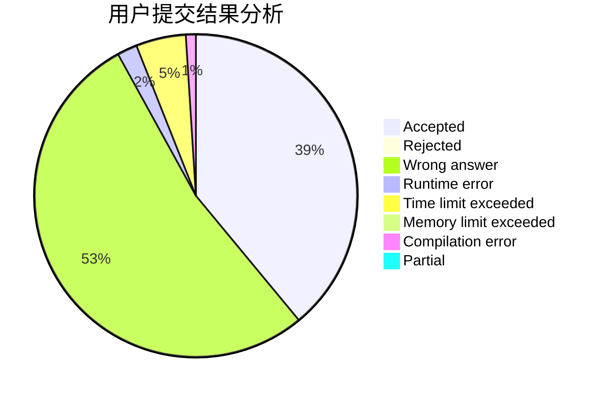
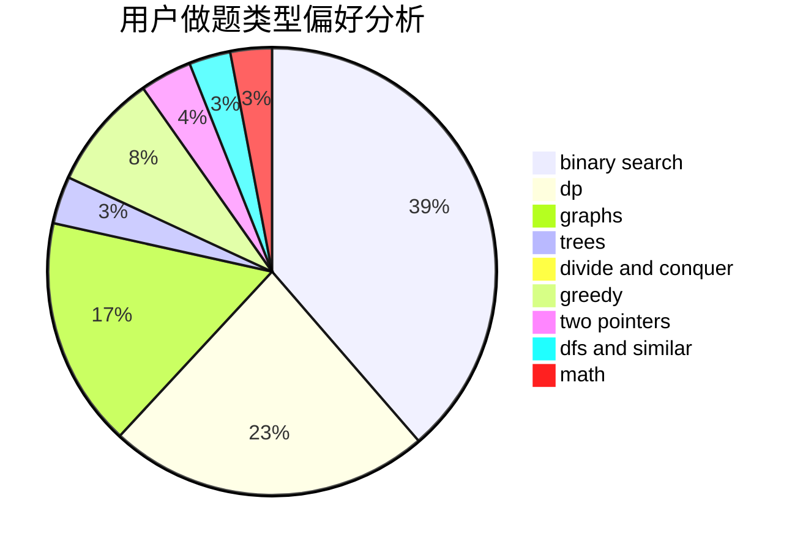

# skyh

<!-- tabs:start -->

#### **用户提交结果分析**

#### **用户做题类型偏好分析**

<!-- tabs:end -->
# 推荐题目
[1438A](https://codeforces.com/contest/1438/problem/A)
[993C](https://codeforces.com/contest/993/problem/C)
[948B](https://codeforces.com/contest/948/problem/B)
[148E](https://codeforces.com/contest/148/problem/E)
[10922](https://codeforces.com/contest/1092/problem/2)
[468E](https://codeforces.com/contest/468/problem/E)
[827A](https://codeforces.com/contest/827/problem/A)
[1482C](https://codeforces.com/contest/1482/problem/C)
[1389E](https://codeforces.com/contest/1389/problem/E)
[1280F](https://codeforces.com/contest/1280/problem/F)
