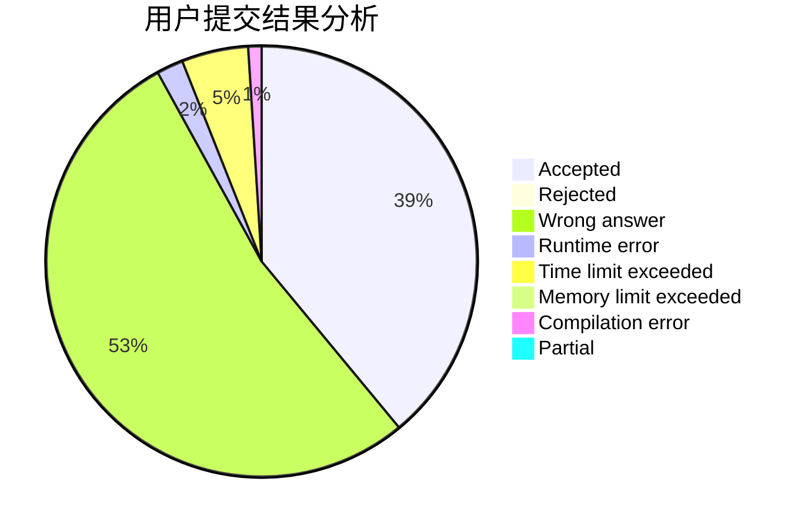
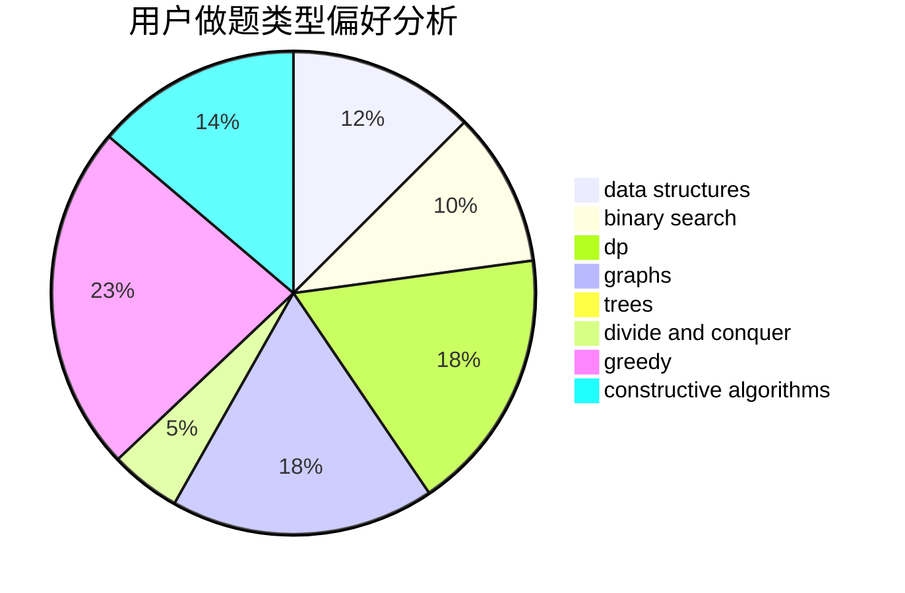
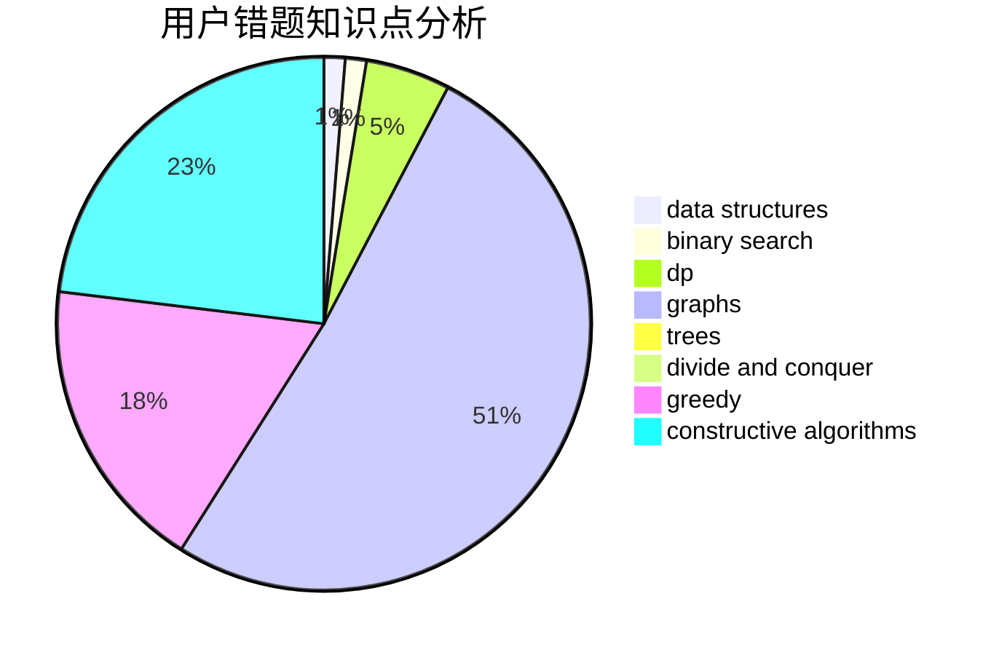

# skyh
<!-- tabs:start -->
#### **用户提交结果分析**

#### **用户做题类型偏好分析**

#### **用户错题知识点分析**

<!-- tabs:end -->
# 推荐题目
[Lucky Numbers (Hard Version)](http://codeforces.com/problemset/problem/1428/G2)		dp,
                        greedy		  
[Universal Solution](http://codeforces.com/problemset/problem/1380/B)		greedy		  
[Portals](http://codeforces.com/problemset/problem/1271/D)		data structures,
                        dp,
                        greedy,
                        implementation,
                        sortings		  
[Saitama Destroys Hotel](http://codeforces.com/problemset/problem/608/A)		implementation,
                        math		  
[Email from Polycarp](http://codeforces.com/problemset/problem/1185/B)		implementation,
                        strings		  
[Kuro and Walking Route](http://codeforces.com/problemset/problem/979/C)		dfs and similar,
                        trees		  
[Heidi Learns Hashing (Easy)](http://codeforces.com/problemset/problem/1184/A1)		brute force,
                        math,
                        number theory		  
[Maximum Xor Secondary](http://codeforces.com/problemset/problem/280/B)		data structures,
                        implementation,
                        two pointers		  
[World of Darkraft - 2](http://codeforces.com/problemset/problem/464/D)		dp,
                        probabilities		  
[Contact ATC](http://codeforces.com/problemset/problem/924/D)		nan		  
<!-- tabs:start -->
#### **data structures**
[Lucky Numbers (Hard Version)](http://codeforces.com/problemset/problem/1271/D)		data structures,
                        dp,
                        greedy,
                        implementation,
                        sortings		  
[Universal Solution](http://codeforces.com/problemset/problem/280/B)		data structures,
                        implementation,
                        two pointers		  
[Portals](http://codeforces.com/problemset/problem/900/E)		data structures,
                        dp,
                        strings		  
[Saitama Destroys Hotel](http://codeforces.com/problemset/problem/475/F)		data structures		  
[Email from Polycarp](http://codeforces.com/problemset/problem/343/D)		data structures,
                        dfs and similar,
                        graphs,
                        trees		  
[Kuro and Walking Route](http://codeforces.com/problemset/problem/1416/A)		binary search,
                        data structures,
                        implementation,
                        two pointers		  
[Heidi Learns Hashing (Easy)](https://codeforces.com/contest/1321/problem/F)		data structures,
                        hashing,
                        strings		  
[Maximum Xor Secondary](http://codeforces.com/problemset/problem/1234/D)		data structures		  
[World of Darkraft - 2](http://codeforces.com/problemset/problem/671/E)		data structures,
                        greedy		  
[Contact ATC](http://codeforces.com/problemset/problem/1492/C)		binary search,
                        data structures,
                        dp,
                        greedy,
                        two pointers		  
#### **binary search**
[Lucky Numbers (Hard Version)](http://codeforces.com/problemset/problem/1178/H)		binary search,
                        flows,
                        graphs		  
[Universal Solution](http://codeforces.com/problemset/problem/830/A)		binary search,
                        brute force,
                        dp,
                        greedy,
                        sortings		  
[Portals](http://codeforces.com/problemset/problem/777/D)		binary search,
                        greedy,
                        implementation,
                        strings		  
[Saitama Destroys Hotel](http://codeforces.com/problemset/problem/1416/A)		binary search,
                        data structures,
                        implementation,
                        two pointers		  
[Email from Polycarp](http://codeforces.com/problemset/problem/809/B)		binary search,
                        interactive		  
[Kuro and Walking Route](http://codeforces.com/problemset/problem/1492/C)		binary search,
                        data structures,
                        dp,
                        greedy,
                        two pointers		  
[Heidi Learns Hashing (Easy)](http://codeforces.com/problemset/problem/1463/D)		binary search,
                        constructive algorithms,
                        greedy,
                        two pointers		  
[Maximum Xor Secondary](http://codeforces.com/problemset/problem/1490/G)		binary search,
                        data structures,
                        math		  
[World of Darkraft - 2](http://codeforces.com/problemset/problem/1479/D)		binary search,
                        bitmasks,
                        brute force,
                        data structures,
                        probabilities,
                        trees		  
[Contact ATC](http://codeforces.com/problemset/problem/1436/E)		binary search,
                        data structures,
                        two pointers		  
#### **dp**
[Lucky Numbers (Hard Version)](http://codeforces.com/problemset/problem/1428/G2)		dp,
                        greedy		  
[Universal Solution](http://codeforces.com/problemset/problem/1271/D)		data structures,
                        dp,
                        greedy,
                        implementation,
                        sortings		  
[Portals](http://codeforces.com/problemset/problem/464/D)		dp,
                        probabilities		  
[Saitama Destroys Hotel](http://codeforces.com/problemset/problem/1396/C)		dp,
                        greedy,
                        implementation		  
[Email from Polycarp](http://codeforces.com/problemset/problem/296/B)		combinatorics,
                        dp		  
[Kuro and Walking Route](http://codeforces.com/problemset/problem/900/E)		data structures,
                        dp,
                        strings		  
[Heidi Learns Hashing (Easy)](http://codeforces.com/problemset/problem/858/C)		dp,
                        greedy,
                        implementation		  
[Maximum Xor Secondary](http://codeforces.com/problemset/problem/830/A)		binary search,
                        brute force,
                        dp,
                        greedy,
                        sortings		  
[World of Darkraft - 2](http://codeforces.com/problemset/problem/762/D)		dp,
                        greedy,
                        implementation		  
[Contact ATC](http://codeforces.com/problemset/problem/913/C)		bitmasks,
                        dp,
                        greedy		  
#### **graph**
[Lucky Numbers (Hard Version)](http://codeforces.com/problemset/problem/575/B)		dfs and similar,
                        graphs,
                        trees		  
[Universal Solution](http://codeforces.com/problemset/problem/1178/H)		binary search,
                        flows,
                        graphs		  
[Portals](https://codeforces.com/contest/745/problem/C)		dfs and similar,
                        graphs		  
[Saitama Destroys Hotel](http://codeforces.com/problemset/problem/449/B)		graphs,
                        greedy,
                        shortest paths		  
[Email from Polycarp](http://codeforces.com/problemset/problem/343/D)		data structures,
                        dfs and similar,
                        graphs,
                        trees		  
[Kuro and Walking Route](http://codeforces.com/problemset/problem/1487/C)		brute force,
                        constructive algorithms,
                        dfs and similar,
                        graphs,
                        greedy,
                        implementation,
                        math		  
[Heidi Learns Hashing (Easy)](http://codeforces.com/problemset/problem/1437/C)		dp,
                        flows,
                        graph matchings,
                        greedy,
                        math,
                        sortings		  
[Maximum Xor Secondary](http://codeforces.com/problemset/problem/1470/D)		constructive algorithms,
                        dfs and similar,
                        graph matchings,
                        graphs,
                        greedy		  
[World of Darkraft - 2](http://codeforces.com/problemset/problem/1476/C)		dp,
                        graphs,
                        greedy		  
[Contact ATC](http://codeforces.com/problemset/problem/1304/D)		constructive algorithms,
                        graphs,
                        greedy,
                        two pointers		  
#### **trees**
[Lucky Numbers (Hard Version)](http://codeforces.com/problemset/problem/979/C)		dfs and similar,
                        trees		  
[Universal Solution](http://codeforces.com/problemset/problem/575/B)		dfs and similar,
                        graphs,
                        trees		  
[Portals](http://codeforces.com/problemset/problem/343/D)		data structures,
                        dfs and similar,
                        graphs,
                        trees		  
[Saitama Destroys Hotel](http://codeforces.com/problemset/problem/1479/D)		binary search,
                        bitmasks,
                        brute force,
                        data structures,
                        probabilities,
                        trees		  
[Email from Polycarp](http://codeforces.com/problemset/problem/1511/C)		brute force,
                        data structures,
                        implementation,
                        trees		  
[Kuro and Walking Route](http://codeforces.com/problemset/problem/1499/F)		combinatorics,
                        dfs and similar,
                        dp,
                        trees		  
[Heidi Learns Hashing (Easy)](http://codeforces.com/problemset/problem/1491/E)		brute force,
                        dfs and similar,
                        divide and conquer,
                        number theory,
                        trees		  
[Maximum Xor Secondary](http://codeforces.com/problemset/problem/1466/D)		data structures,
                        greedy,
                        sortings,
                        trees		  
[World of Darkraft - 2](http://codeforces.com/problemset/problem/1495/D)		combinatorics,
                        dfs and similar,
                        graphs,
                        math,
                        shortest paths,
                        trees		  
[Contact ATC](http://codeforces.com/problemset/problem/1303/G)		data structures,
                        divide and conquer,
                        geometry,
                        trees		  
#### **divide and conquer**
[Lucky Numbers (Hard Version)](http://codeforces.com/problemset/problem/1461/D)		binary search,
                        brute force,
                        data structures,
                        divide and conquer,
                        implementation,
                        sortings		  
[Universal Solution](http://codeforces.com/problemset/problem/1466/G)		combinatorics,
                        divide and conquer,
                        hashing,
                        math,
                        string suffix structures,
                        strings		  
[Portals](http://codeforces.com/problemset/problem/1490/D)		dfs and similar,
                        divide and conquer,
                        implementation		  
[Saitama Destroys Hotel](https://codeforces.com/contest/1483/problem/C)		data structures,
                        divide and conquer,
                        dp		  
[Email from Polycarp](http://codeforces.com/problemset/problem/1491/E)		brute force,
                        dfs and similar,
                        divide and conquer,
                        number theory,
                        trees		  
[Kuro and Walking Route](http://codeforces.com/problemset/problem/1303/G)		data structures,
                        divide and conquer,
                        geometry,
                        trees		  
[Heidi Learns Hashing (Easy)](http://codeforces.com/problemset/problem/1494/D)		constructive algorithms,
                        data structures,
                        dfs and similar,
                        divide and conquer,
                        dsu,
                        greedy,
                        sortings,
                        trees		  
[Maximum Xor Secondary](http://codeforces.com/problemset/problem/1482/E)		data structures,
                        divide and conquer,
                        dp		  
[World of Darkraft - 2](http://codeforces.com/problemset/problem/566/C)		dfs and similar,
                        divide and conquer,
                        trees		  
[Contact ATC](http://codeforces.com/problemset/problem/1428/F)		binary search,
                        data structures,
                        divide and conquer,
                        dp,
                        two pointers		  
#### **greedy**
[Lucky Numbers (Hard Version)](http://codeforces.com/problemset/problem/1428/G2)		dp,
                        greedy		  
[Universal Solution](http://codeforces.com/problemset/problem/1380/B)		greedy		  
[Portals](http://codeforces.com/problemset/problem/1271/D)		data structures,
                        dp,
                        greedy,
                        implementation,
                        sortings		  
[Saitama Destroys Hotel](http://codeforces.com/problemset/problem/1396/C)		dp,
                        greedy,
                        implementation		  
[Email from Polycarp](http://codeforces.com/problemset/problem/858/C)		dp,
                        greedy,
                        implementation		  
[Kuro and Walking Route](http://codeforces.com/problemset/problem/830/A)		binary search,
                        brute force,
                        dp,
                        greedy,
                        sortings		  
[Heidi Learns Hashing (Easy)](http://codeforces.com/problemset/problem/449/B)		graphs,
                        greedy,
                        shortest paths		  
[Maximum Xor Secondary](http://codeforces.com/problemset/problem/526/B)		dfs and similar,
                        greedy,
                        implementation		  
[World of Darkraft - 2](http://codeforces.com/problemset/problem/762/D)		dp,
                        greedy,
                        implementation		  
[Contact ATC](http://codeforces.com/problemset/problem/913/C)		bitmasks,
                        dp,
                        greedy		  
#### **constructive algorithms**
[Lucky Numbers (Hard Version)](http://codeforces.com/problemset/problem/1028/E)		constructive algorithms		  
[Universal Solution](http://codeforces.com/problemset/problem/1443/A)		constructive algorithms,
                        math		  
[Portals](http://codeforces.com/problemset/problem/1493/A)		constructive algorithms,
                        greedy		  
[Saitama Destroys Hotel](http://codeforces.com/problemset/problem/1463/D)		binary search,
                        constructive algorithms,
                        greedy,
                        two pointers		  
[Email from Polycarp](https://codeforces.com/contest/1456/problem/B)		bitmasks,
                        brute force,
                        constructive algorithms		  
[Kuro and Walking Route](http://codeforces.com/problemset/problem/1492/D)		bitmasks,
                        constructive algorithms,
                        greedy,
                        math		  
[Heidi Learns Hashing (Easy)](https://codeforces.com/contest/1504/problem/D)		constructive algorithms,
                        games,
                        interactive		  
[Maximum Xor Secondary](https://codeforces.com/contest/1483/problem/A)		brute force,
                        constructive algorithms,
                        greedy,
                        implementation		  
[World of Darkraft - 2](https://codeforces.com/contest/1457/problem/D)		bitmasks,
                        brute force,
                        constructive algorithms		  
[Contact ATC](http://codeforces.com/problemset/problem/1513/A)		constructive algorithms,
                        implementation		  
#### **sortings**
[Lucky Numbers (Hard Version)](http://codeforces.com/problemset/problem/1271/D)		data structures,
                        dp,
                        greedy,
                        implementation,
                        sortings		  
[Universal Solution](http://codeforces.com/problemset/problem/830/A)		binary search,
                        brute force,
                        dp,
                        greedy,
                        sortings		  
[Portals](https://codeforces.com/contest/1496/problem/C)		geometry,
                        greedy,
                        math,
                        sortings		  
[Saitama Destroys Hotel](http://codeforces.com/problemset/problem/1495/A)		geometry,
                        greedy,
                        math,
                        sortings		  
[Email from Polycarp](http://codeforces.com/problemset/problem/1497/A)		brute force,
                        data structures,
                        greedy,
                        sortings		  
[Kuro and Walking Route](http://codeforces.com/problemset/problem/1427/A)		math,
                        sortings		  
[Heidi Learns Hashing (Easy)](http://codeforces.com/problemset/problem/1461/D)		binary search,
                        brute force,
                        data structures,
                        divide and conquer,
                        implementation,
                        sortings		  
[Maximum Xor Secondary](http://codeforces.com/problemset/problem/1437/C)		dp,
                        flows,
                        graph matchings,
                        greedy,
                        math,
                        sortings		  
[World of Darkraft - 2](http://codeforces.com/problemset/problem/1473/A)		greedy,
                        implementation,
                        math,
                        sortings		  
[Contact ATC](http://codeforces.com/problemset/problem/1486/B)		binary search,
                        geometry,
                        shortest paths,
                        sortings		  
<!-- tabs:end -->
