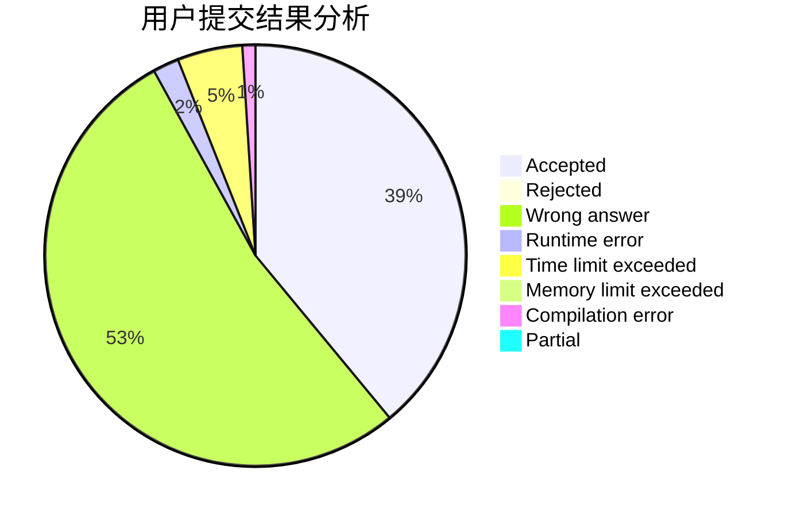
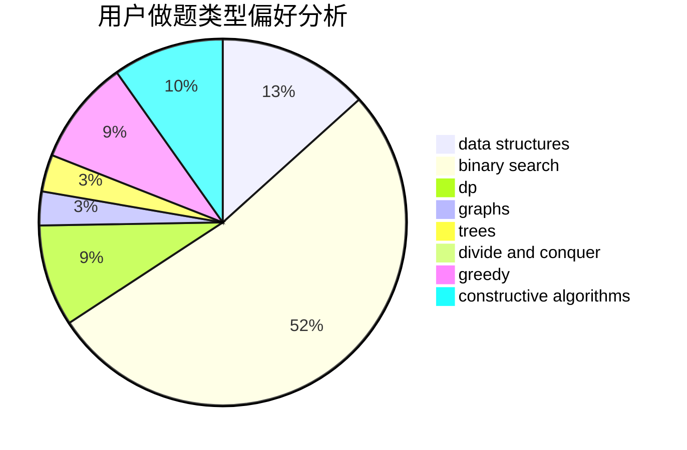
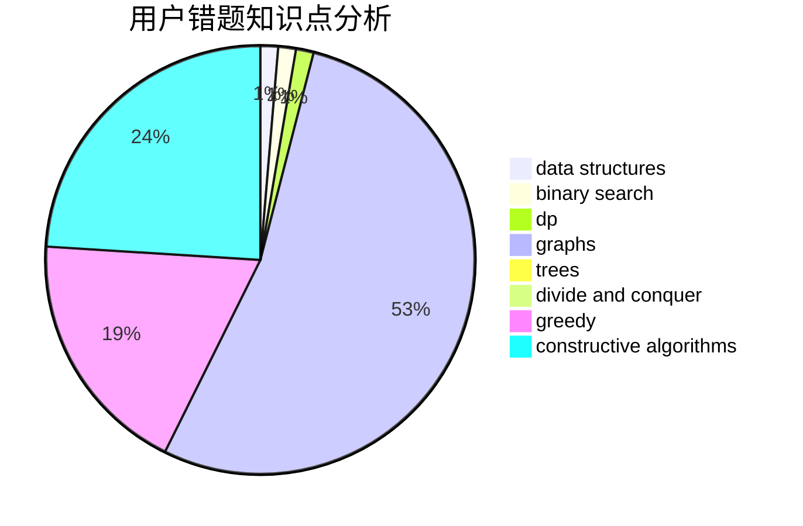

# skyh

<!-- tabs:start -->

#### **用户提交结果分析**

#### **用户做题类型偏好分析**

#### **用户错题知识点分析**

<!-- tabs:end -->
# 推荐题目
[1438A](https://codeforces.com/contest/1438/problem/A)		constructive algorithms,
                        implementation		  
[993C](https://codeforces.com/contest/993/problem/C)		bitmasks,
                        brute force,
                        geometry		  
[948B](https://codeforces.com/contest/948/problem/B)		dsu,graphs,sortings,trees		  
[148E](https://codeforces.com/contest/148/problem/E)		dp		  
[10922](https://codeforces.com/contest/1092/problem/2)		dsu,graphs,sortings,trees		  
[468E](https://codeforces.com/contest/468/problem/E)		dp,
                        graph matchings,
                        math,
                        meet-in-the-middle		  
[827A](https://codeforces.com/contest/827/problem/A)		data structures,
                        greedy,
                        sortings,
                        strings		  
[1482C](https://codeforces.com/contest/1482/problem/C)		brute force,
                        constructive algorithms,
                        greedy,
                        implementation		  
[1389E](https://codeforces.com/contest/1389/problem/E)		math,
                        number theory		  
[1280F](https://codeforces.com/contest/1280/problem/F)		combinatorics,
                        constructive algorithms,
                        math		  
