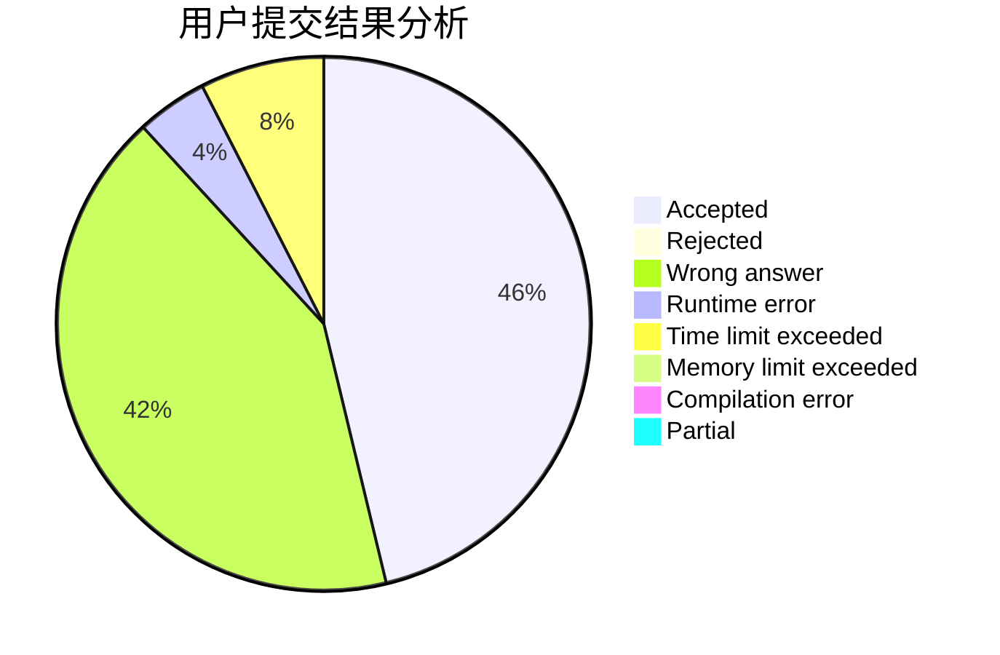
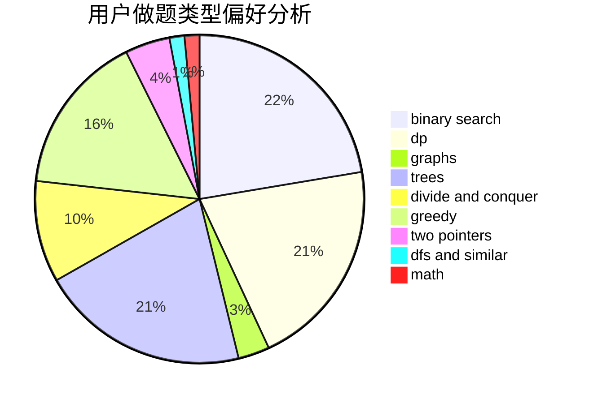

# CHENRUIJIE

<!-- tabs:start -->

#### **用户提交结果分析**

#### **用户做题类型偏好分析**

<!-- tabs:end -->
# 推荐题目
[317E](https://codeforces.com/contest/317/problem/E)
[61E](https://codeforces.com/contest/61/problem/E)
[1228C](https://codeforces.com/contest/1228/problem/C)
[291A](https://codeforces.com/contest/291/problem/A)
[1190E](https://codeforces.com/contest/1190/problem/E)
[269D](https://codeforces.com/contest/269/problem/D)
[13042](https://codeforces.com/contest/1304/problem/2)
[1218C](https://codeforces.com/contest/1218/problem/C)
[1194C](https://codeforces.com/contest/1194/problem/C)
[271D](https://codeforces.com/contest/271/problem/D)
