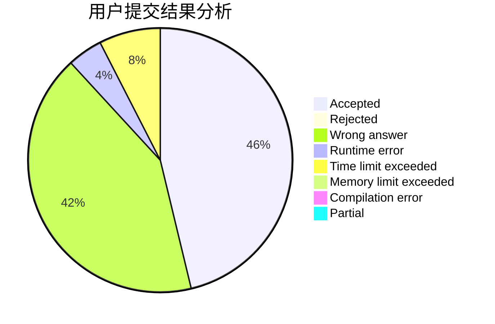
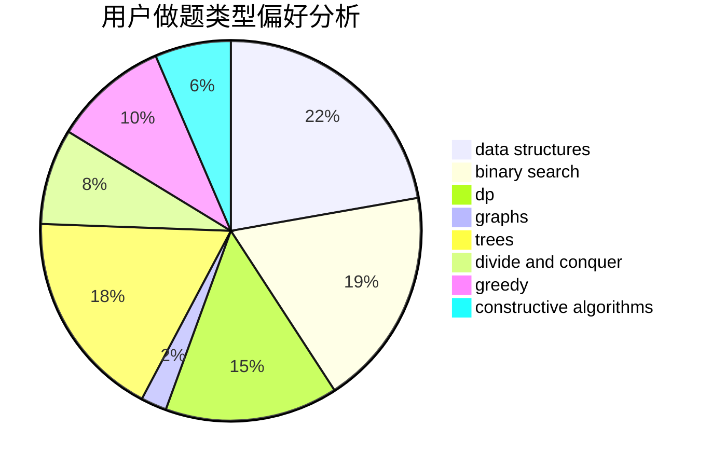
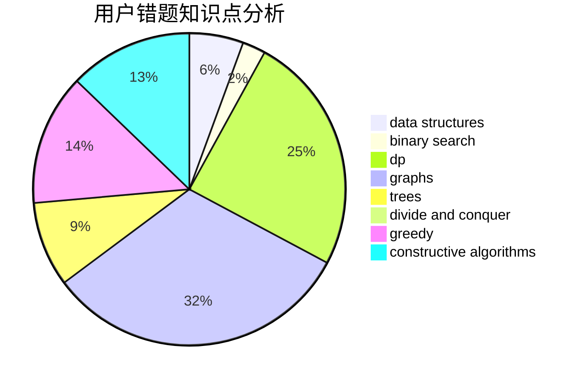

# CHENRUIJIE

<!-- tabs:start -->

#### **用户提交结果分析**

#### **用户做题类型偏好分析**

#### **用户错题知识点分析**

<!-- tabs:end -->
# 推荐题目
[317E](https://codeforces.com/contest/317/problem/E)		constructive algorithms,
                        shortest paths		  
[61E](https://codeforces.com/contest/61/problem/E)		data structures,
                        trees		  
[1228C](https://codeforces.com/contest/1228/problem/C)		math,
                        number theory		  
[291A](https://codeforces.com/contest/291/problem/A)		*special problem,
                        implementation,
                        sortings		  
[1190E](https://codeforces.com/contest/1190/problem/E)		binary search,
                        greedy		  
[269D](https://codeforces.com/contest/269/problem/D)		data structures,
                        dp,
                        graphs,
                        sortings		  
[13042](https://codeforces.com/contest/1304/problem/2)		dsu,graphs,sortings,trees		  
[1218C](https://codeforces.com/contest/1218/problem/C)		dp		  
[1194C](https://codeforces.com/contest/1194/problem/C)		implementation,
                        strings		  
[271D](https://codeforces.com/contest/271/problem/D)		data structures,
                        strings		  
