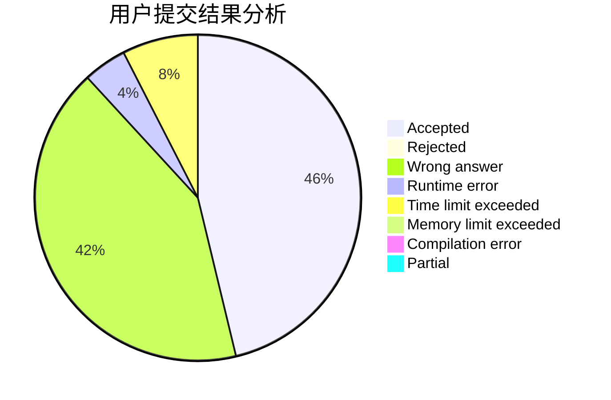
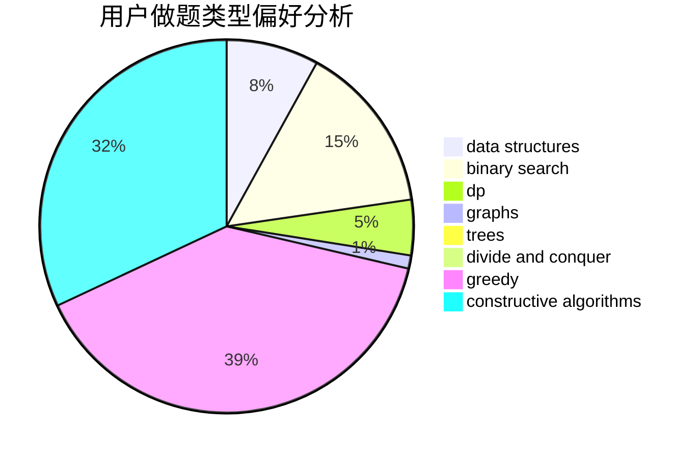
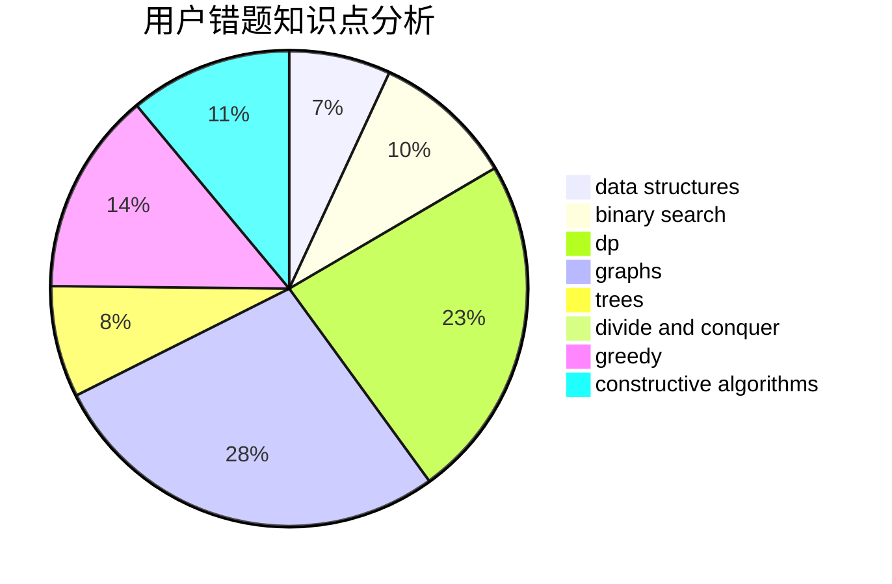

# CHENRUIJIE

<!-- tabs:start -->

#### **用户提交结果分析**

#### **用户做题类型偏好分析**

#### **用户错题知识点分析**

<!-- tabs:end -->
# 推荐题目
[2A](https://codeforces.com/contest/2/problem/A)		hashing,
                        implementation		  
[600D](https://codeforces.com/contest/600/problem/D)		geometry		  
[1220C](https://codeforces.com/contest/1220/problem/C)		games,
                        greedy,
                        strings		  
[276D](https://codeforces.com/contest/276/problem/D)		bitmasks,
                        dp,
                        greedy,
                        implementation,
                        math		  
[1187C](https://codeforces.com/contest/1187/problem/C)		constructive algorithms,
                        greedy,
                        implementation		  
[251B](https://codeforces.com/contest/251/problem/B)		implementation,
                        math		  
[1296F](https://codeforces.com/contest/1296/problem/F)		constructive algorithms,
                        dfs and similar,
                        greedy,
                        sortings,
                        trees		  
[1213D2](https://codeforces.com/contest/1213D/problem/2)		brute force,
                        math,
                        sortings		  
[1189A](https://codeforces.com/contest/1189/problem/A)		strings		  
[253D](https://codeforces.com/contest/253/problem/D)		brute force,
                        two pointers		  
