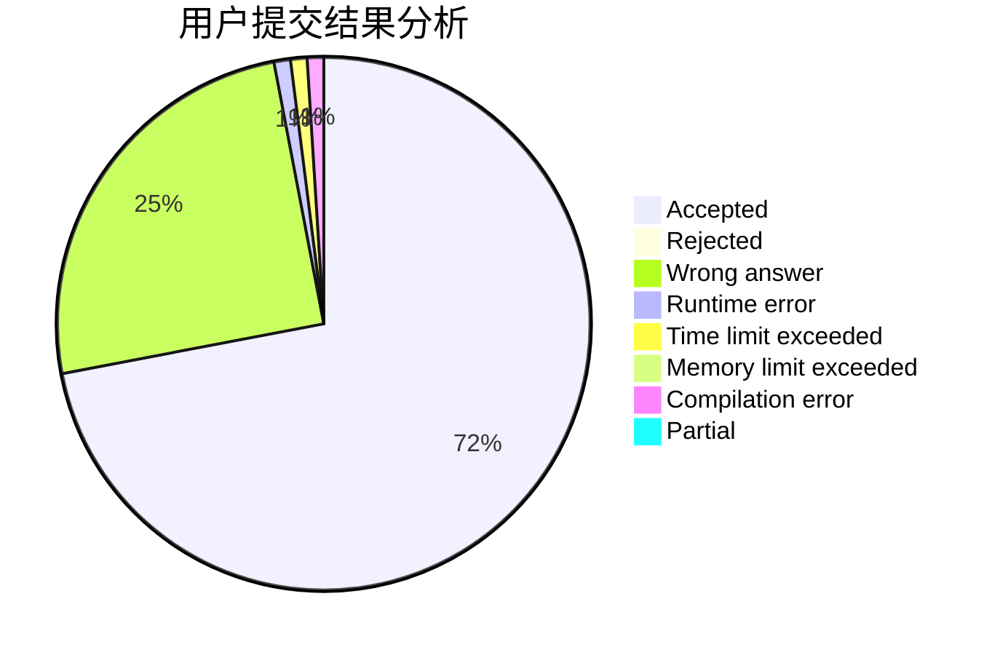
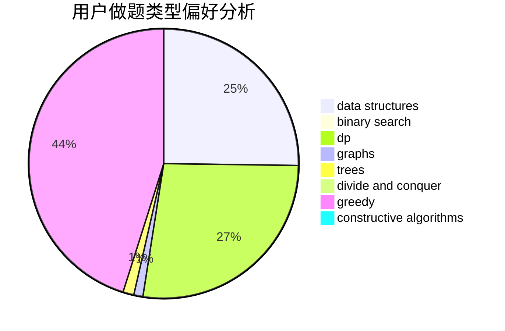
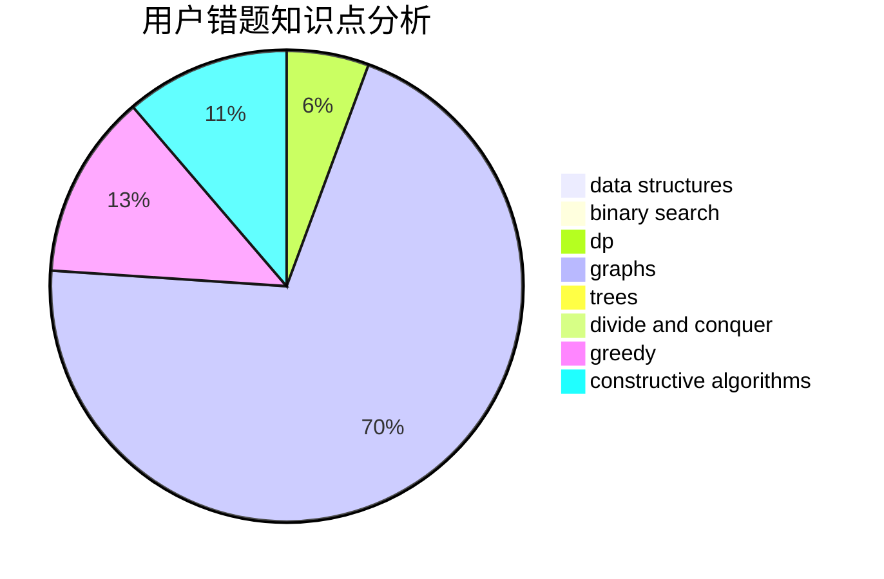

# skywalkert

<!-- tabs:start -->

#### **用户提交结果分析**

#### **用户做题类型偏好分析**

#### **用户错题知识点分析**

<!-- tabs:end -->
# 推荐题目
[14461](https://codeforces.com/contest/1446/problem/1)		dsu,graphs,sortings,trees		  
[1425D](https://codeforces.com/contest/1425/problem/D)		combinatorics,
                        dp,
                        math		  
[1300C](https://codeforces.com/contest/1300/problem/C)		dsu,graphs,sortings,trees		  
[957E](https://codeforces.com/contest/957/problem/E)		dsu,graphs,sortings,trees		  
[930C](https://codeforces.com/contest/930/problem/C)		data structures,
                        dp		  
[415A](https://codeforces.com/contest/415/problem/A)		implementation		  
[1459F](https://codeforces.com/contest/1459/problem/F)		dsu,graphs,sortings,trees		  
[771C](https://codeforces.com/contest/771/problem/C)		dfs and similar,
                        dp,
                        trees		  
[24E](https://codeforces.com/contest/24/problem/E)		binary search		  
[634D](https://codeforces.com/contest/634/problem/D)		dsu,graphs,sortings,trees		  
