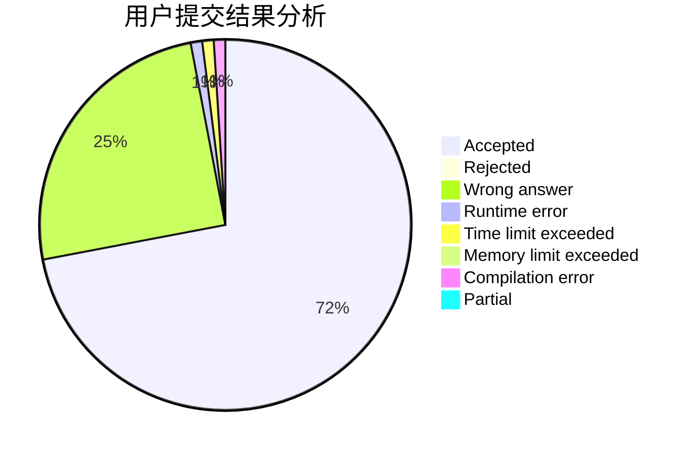
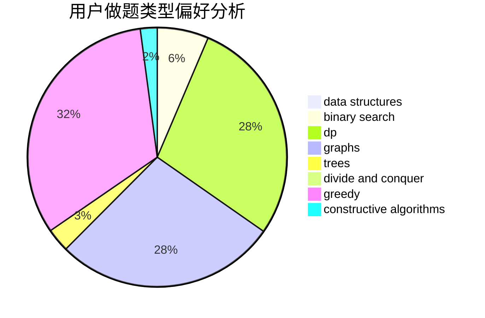
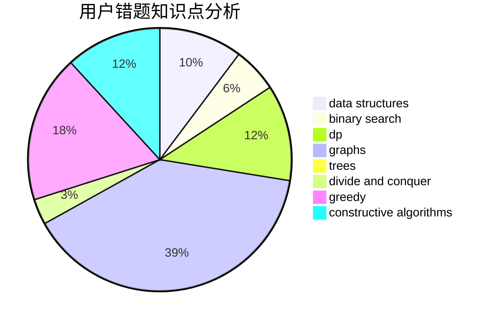

# skywalkert

<!-- tabs:start -->

#### **用户提交结果分析**

#### **用户做题类型偏好分析**

#### **用户错题知识点分析**

<!-- tabs:end -->
# 推荐题目
[1436A](https://codeforces.com/contest/1436/problem/A)		math		  
[1417F](https://codeforces.com/contest/1417/problem/F)		dsu,graphs,sortings,trees		  
[1294A](https://codeforces.com/contest/1294/problem/A)		math		  
[935F](https://codeforces.com/contest/935/problem/F)		data structures,
                        greedy		  
[911G](https://codeforces.com/contest/911/problem/G)		data structures		  
[385E](https://codeforces.com/contest/385/problem/E)		math,
                        matrices		  
[1450H2](https://codeforces.com/contest/1450H/problem/2)		combinatorics,
                        implementation,
                        math		  
[750G](https://codeforces.com/contest/750/problem/G)		bitmasks,
                        brute force,
                        combinatorics,
                        dp		  
[22B](https://codeforces.com/contest/22/problem/B)		brute force,
                        dp		  
[616F](https://codeforces.com/contest/616/problem/F)		string suffix structures,
                        strings		  
