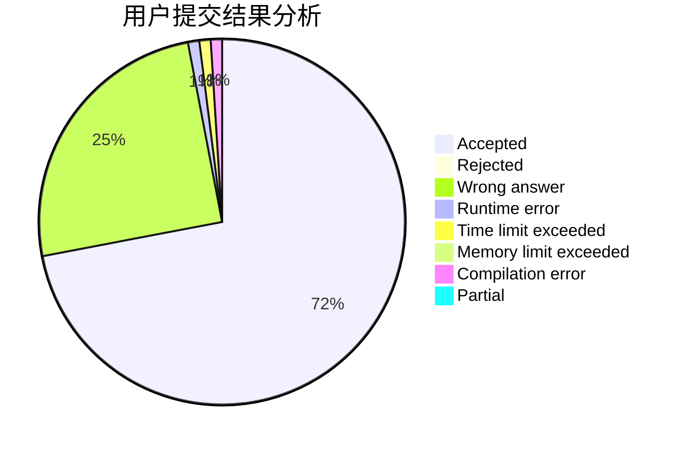
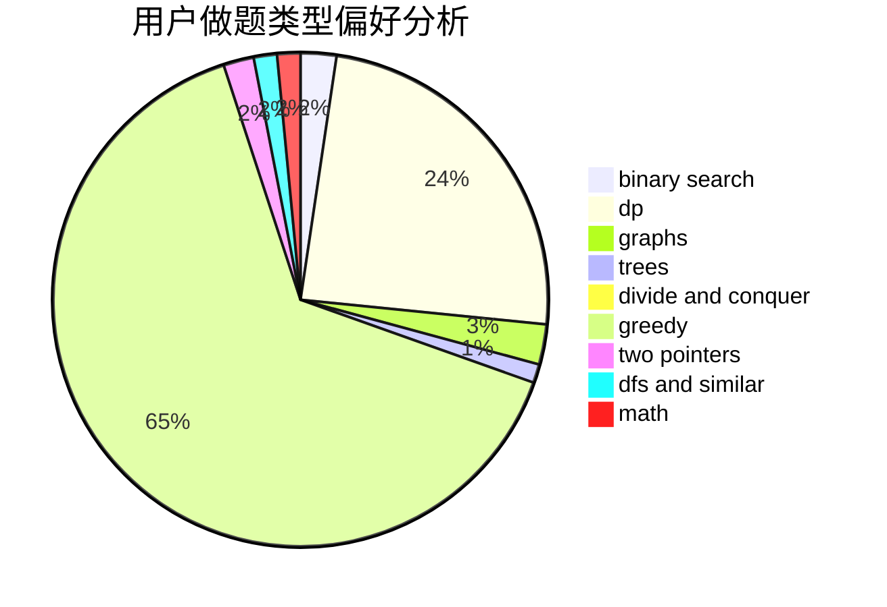

# skywalkert

<!-- tabs:start -->

#### **用户提交结果分析**

#### **用户做题类型偏好分析**

<!-- tabs:end -->
# 推荐题目
[14461](https://codeforces.com/contest/1446/problem/1)
[1425D](https://codeforces.com/contest/1425/problem/D)
[1300C](https://codeforces.com/contest/1300/problem/C)
[957E](https://codeforces.com/contest/957/problem/E)
[930C](https://codeforces.com/contest/930/problem/C)
[415A](https://codeforces.com/contest/415/problem/A)
[1459F](https://codeforces.com/contest/1459/problem/F)
[771C](https://codeforces.com/contest/771/problem/C)
[24E](https://codeforces.com/contest/24/problem/E)
[634D](https://codeforces.com/contest/634/problem/D)
