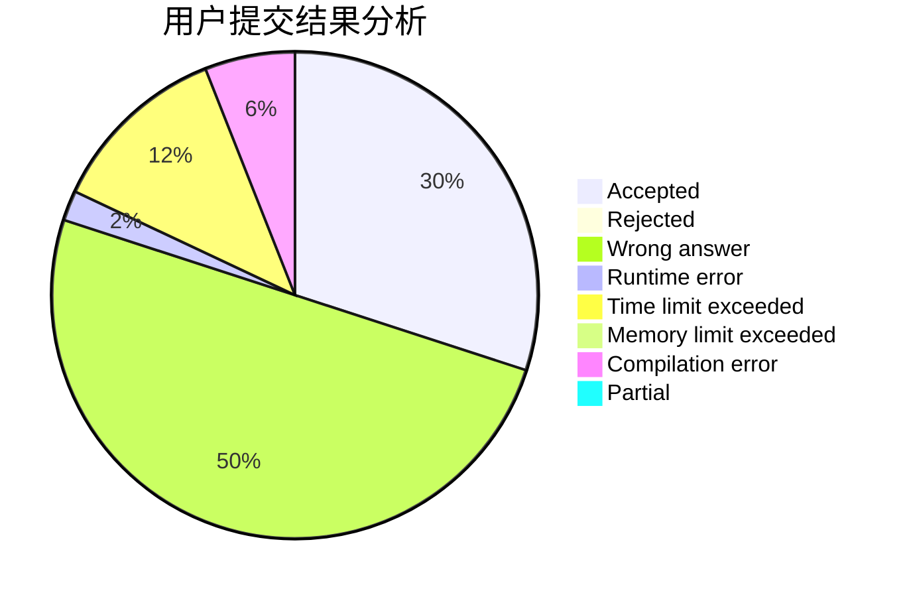
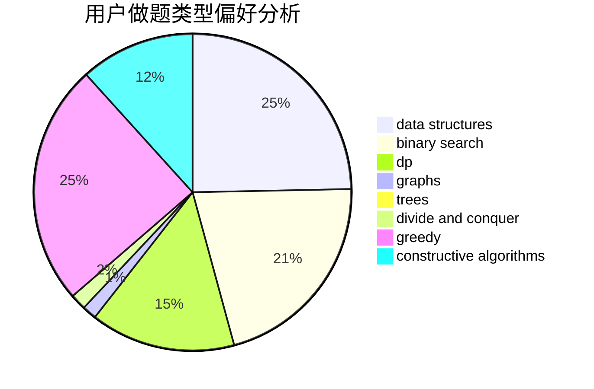

# slayone_platelet

<!-- tabs:start -->

#### **用户提交结果分析**

#### **用户做题类型偏好分析**

#### **用户错题知识点分析**

<!-- tabs:end -->
# 推荐题目
[356D](https://codeforces.com/contest/356/problem/D)		bitmasks,
                        constructive algorithms,
                        dp,
                        greedy		  
[787D](https://codeforces.com/contest/787/problem/D)		dsu,graphs,sortings,trees		  
[708D](https://codeforces.com/contest/708/problem/D)		flows		  
[1506A](https://codeforces.com/contest/1506/problem/A)		math		  
[599C](https://codeforces.com/contest/599/problem/C)		sortings		  
[80B](https://codeforces.com/contest/80/problem/B)		geometry,
                        math		  
[39D](https://codeforces.com/contest/39/problem/D)		math		  
[835B](https://codeforces.com/contest/835/problem/B)		greedy		  
[980D](https://codeforces.com/contest/980/problem/D)		dp,
                        math,
                        number theory		  
[1145A](https://codeforces.com/contest/1145/problem/A)		implementation		  
