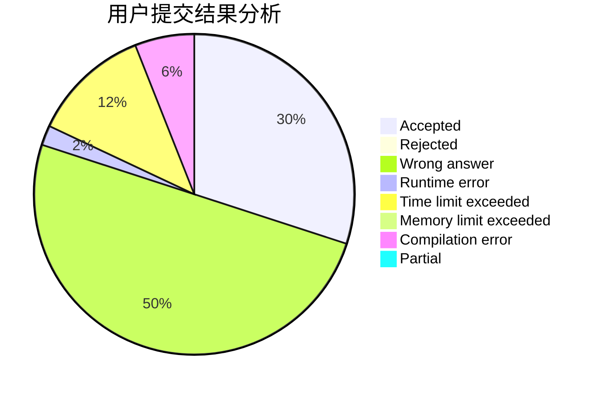
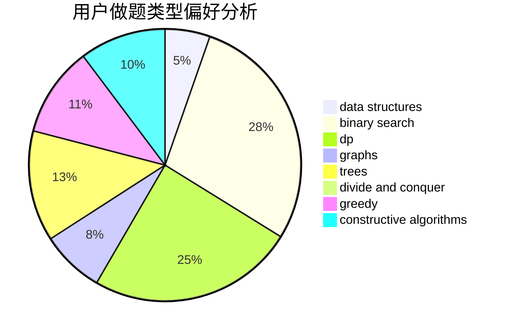

# slayone_platelet

<!-- tabs:start -->

#### **用户提交结果分析**

#### **用户做题类型偏好分析**

#### **用户错题知识点分析**

<!-- tabs:end -->
# 推荐题目
[382E](https://codeforces.com/contest/382/problem/E)		combinatorics,
                        dp		  
[803D](https://codeforces.com/contest/803/problem/D)		binary search,
                        greedy		  
[727F](https://codeforces.com/contest/727/problem/F)		binary search,
                        dp,
                        greedy		  
[157B](https://codeforces.com/contest/157/problem/B)		geometry,
                        sortings		  
[617B](https://codeforces.com/contest/617/problem/B)		combinatorics		  
[827F](https://codeforces.com/contest/827/problem/F)		data structures,
                        dp,
                        graphs,
                        shortest paths		  
[426B](https://codeforces.com/contest/426/problem/B)		implementation		  
[852I](https://codeforces.com/contest/852/problem/I)		brute force,
                        dfs and similar,
                        graphs,
                        trees		  
[995F](https://codeforces.com/contest/995/problem/F)		combinatorics,
                        dp,
                        math,
                        trees		  
[1147B](https://codeforces.com/contest/1147/problem/B)		brute force,
                        strings		  
