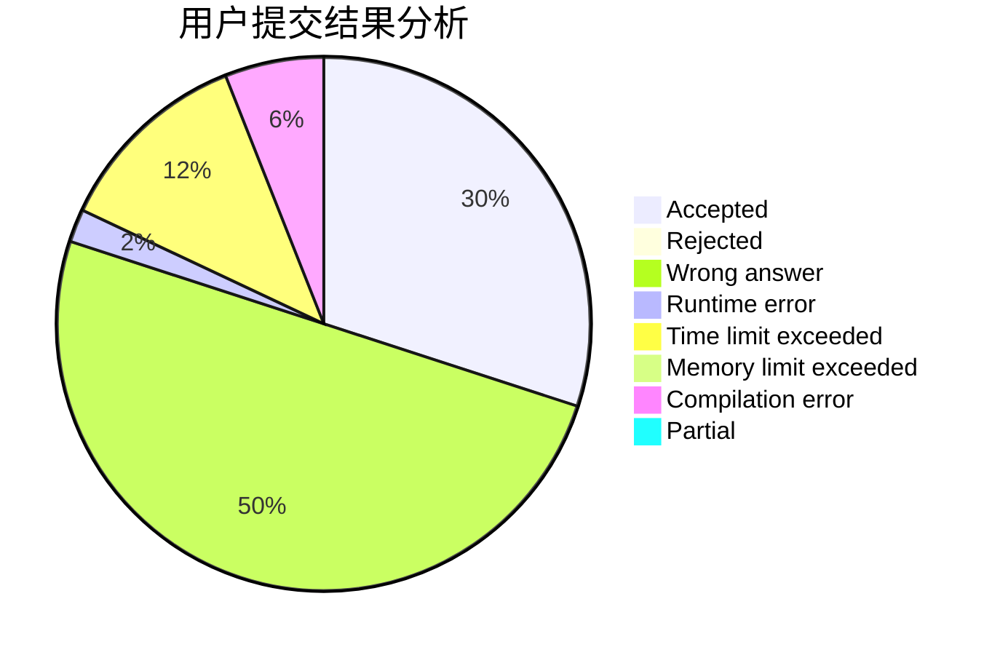
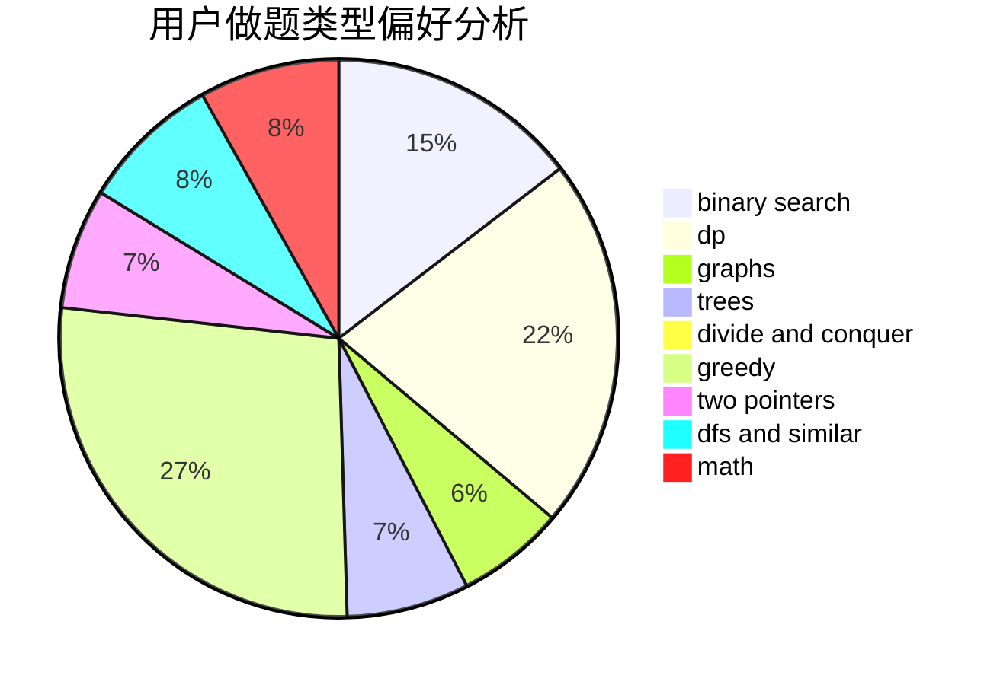

# slayone_platelet

<!-- tabs:start -->

#### **用户提交结果分析**

#### **用户做题类型偏好分析**

<!-- tabs:end -->
# 推荐题目
[382E](https://codeforces.com/contest/382/problem/E)
[803D](https://codeforces.com/contest/803/problem/D)
[727F](https://codeforces.com/contest/727/problem/F)
[157B](https://codeforces.com/contest/157/problem/B)
[617B](https://codeforces.com/contest/617/problem/B)
[827F](https://codeforces.com/contest/827/problem/F)
[426B](https://codeforces.com/contest/426/problem/B)
[852I](https://codeforces.com/contest/852/problem/I)
[995F](https://codeforces.com/contest/995/problem/F)
[1147B](https://codeforces.com/contest/1147/problem/B)
