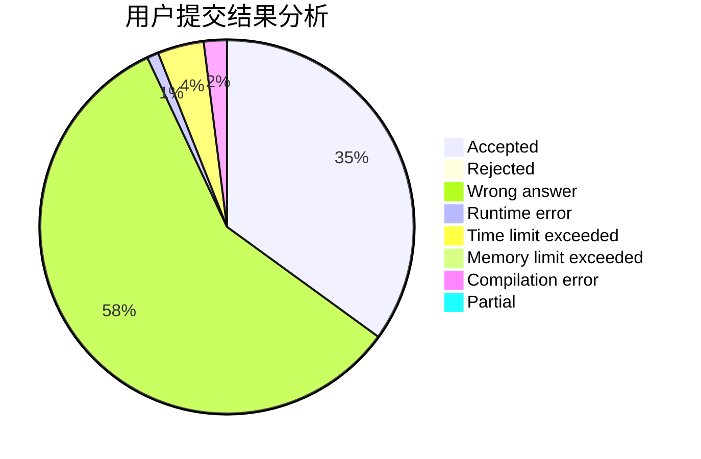
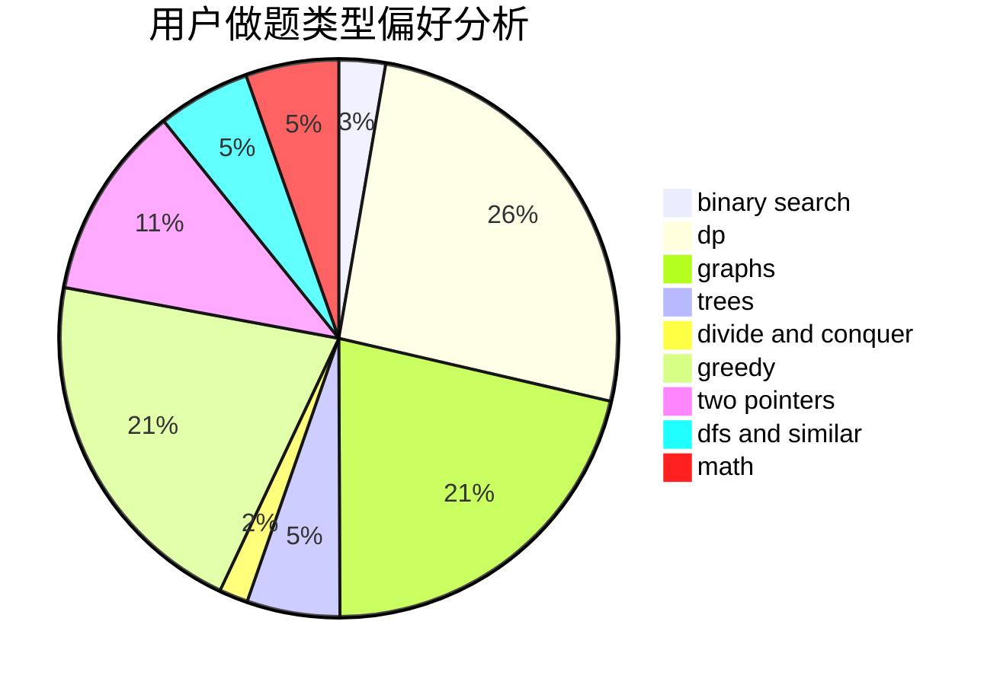

# sleep__

<!-- tabs:start -->

#### **用户提交结果分析**

#### **用户做题类型偏好分析**

<!-- tabs:end -->
# 推荐题目
[1164M](https://codeforces.com/contest/1164/problem/M)
[152E](https://codeforces.com/contest/152/problem/E)
[407B](https://codeforces.com/contest/407/problem/B)
[1340D](https://codeforces.com/contest/1340/problem/D)
[519B](https://codeforces.com/contest/519/problem/B)
[1087C](https://codeforces.com/contest/1087/problem/C)
[898C](https://codeforces.com/contest/898/problem/C)
[295C](https://codeforces.com/contest/295/problem/C)
[1053B](https://codeforces.com/contest/1053/problem/B)
[735E](https://codeforces.com/contest/735/problem/E)
