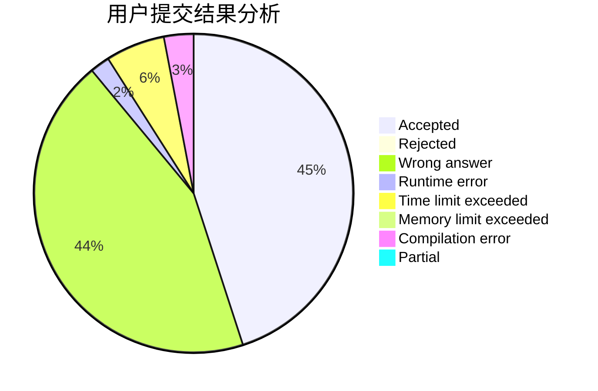
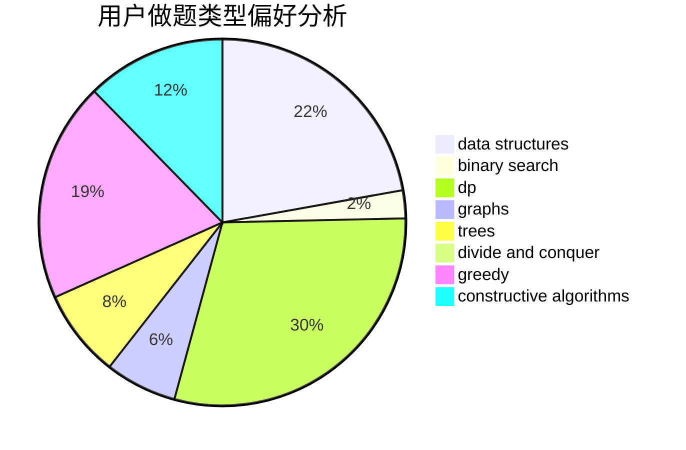
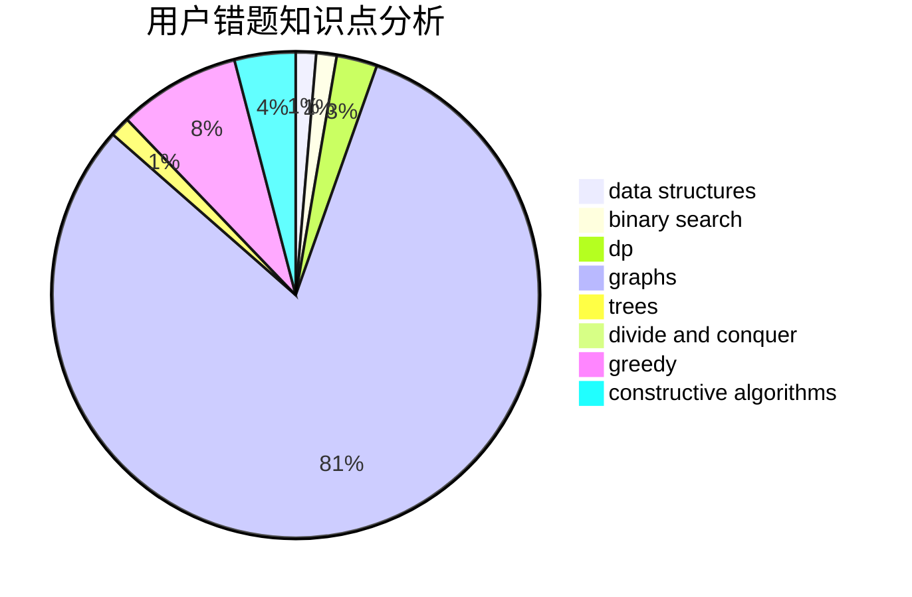

# slowyfine

<!-- tabs:start -->

#### **用户提交结果分析**

#### **用户做题类型偏好分析**

#### **用户错题知识点分析**

<!-- tabs:end -->
# 推荐题目
[437B](https://codeforces.com/contest/437/problem/B)		bitmasks,
                        greedy,
                        implementation,
                        sortings		  
[520A](https://codeforces.com/contest/520/problem/A)		implementation,
                        strings		  
[1065G](https://codeforces.com/contest/1065/problem/G)		strings		  
[1361C](https://codeforces.com/contest/1361/problem/C)		binary search,
                        bitmasks,
                        constructive algorithms,
                        dfs and similar,
                        dsu,
                        graphs		  
[967B](https://codeforces.com/contest/967/problem/B)		math,
                        sortings		  
[827F](https://codeforces.com/contest/827/problem/F)		data structures,
                        dp,
                        graphs,
                        shortest paths		  
[913H](https://codeforces.com/contest/913/problem/H)		math,
                        probabilities		  
[1109F](https://codeforces.com/contest/1109/problem/F)		data structures,
                        trees		  
[602C](https://codeforces.com/contest/602/problem/C)		dsu,graphs,sortings,trees		  
[364A](https://codeforces.com/contest/364/problem/A)		combinatorics,
                        data structures,
                        implementation		  
