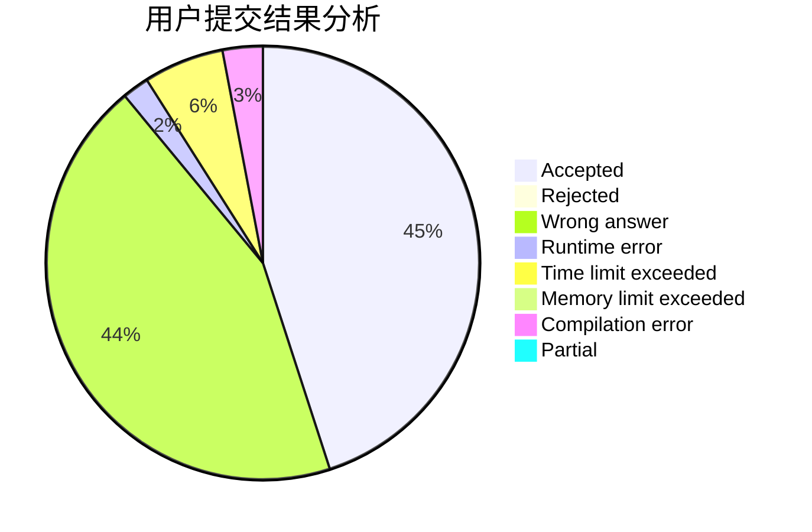
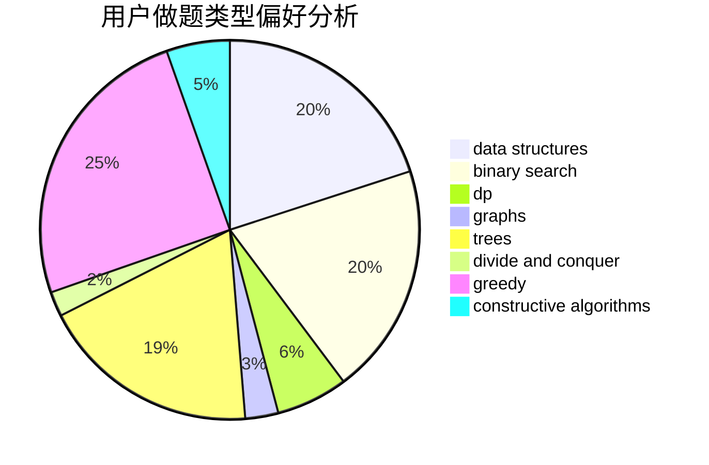
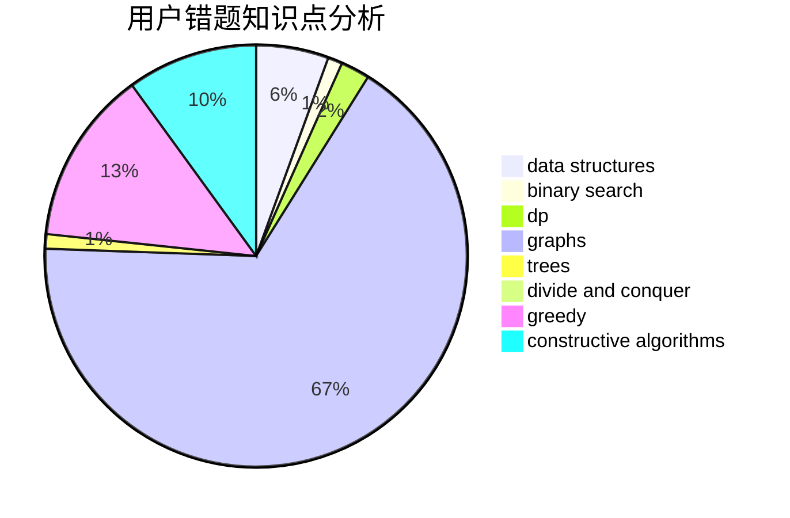

# slowyfine

<!-- tabs:start -->

#### **用户提交结果分析**

#### **用户做题类型偏好分析**

#### **用户错题知识点分析**

<!-- tabs:end -->
# 推荐题目
[409H](https://codeforces.com/contest/409/problem/H)		*special problem,
                        brute force,
                        constructive algorithms,
                        dsu,
                        implementation		  
[4A](https://codeforces.com/contest/4/problem/A)		brute force,
                        math		  
[1065C](https://codeforces.com/contest/1065/problem/C)		greedy		  
[1354F](https://codeforces.com/contest/1354/problem/F)		constructive algorithms,
                        dp,
                        flows,
                        graph matchings,
                        greedy,
                        sortings		  
[94C](https://codeforces.com/contest/94/problem/C)		dsu,graphs,sortings,trees		  
[80B](https://codeforces.com/contest/80/problem/B)		geometry,
                        math		  
[896E](https://codeforces.com/contest/896/problem/E)		data structures,
                        dsu		  
[1109B](https://codeforces.com/contest/1109/problem/B)		constructive algorithms,
                        hashing,
                        strings		  
[581F](https://codeforces.com/contest/581/problem/F)		dp,
                        trees,
                        two pointers		  
[337C](https://codeforces.com/contest/337/problem/C)		binary search,
                        greedy,
                        math,
                        matrices,
                        number theory		  
