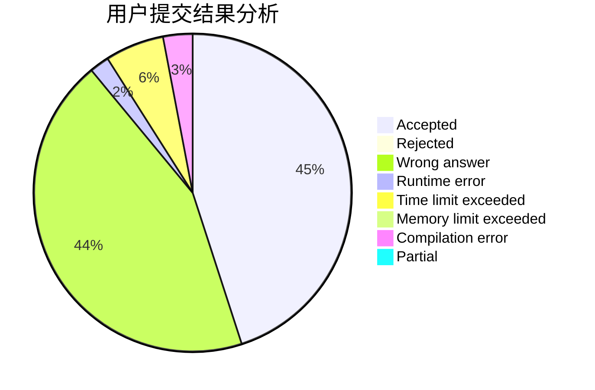
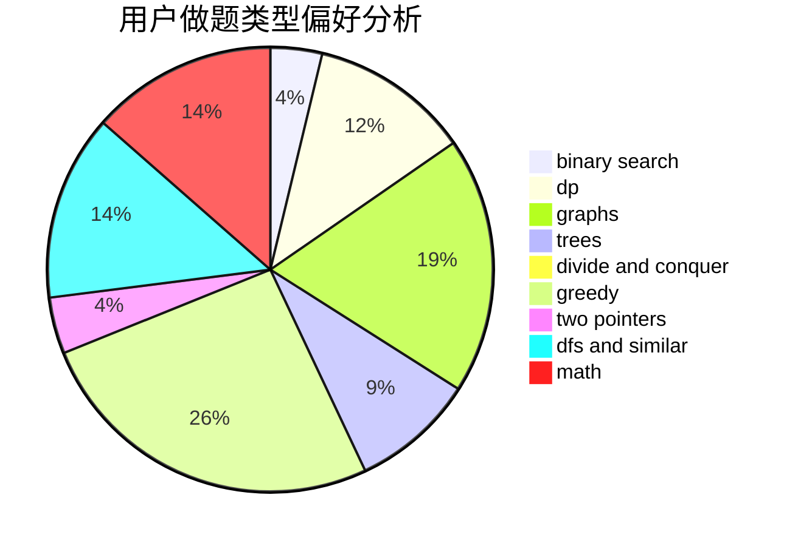

# slowyfine

<!-- tabs:start -->

#### **用户提交结果分析**

#### **用户做题类型偏好分析**

<!-- tabs:end -->
# 推荐题目
[437B](https://codeforces.com/contest/437/problem/B)
[520A](https://codeforces.com/contest/520/problem/A)
[1065G](https://codeforces.com/contest/1065/problem/G)
[1361C](https://codeforces.com/contest/1361/problem/C)
[967B](https://codeforces.com/contest/967/problem/B)
[827F](https://codeforces.com/contest/827/problem/F)
[913H](https://codeforces.com/contest/913/problem/H)
[1109F](https://codeforces.com/contest/1109/problem/F)
[602C](https://codeforces.com/contest/602/problem/C)
[364A](https://codeforces.com/contest/364/problem/A)
