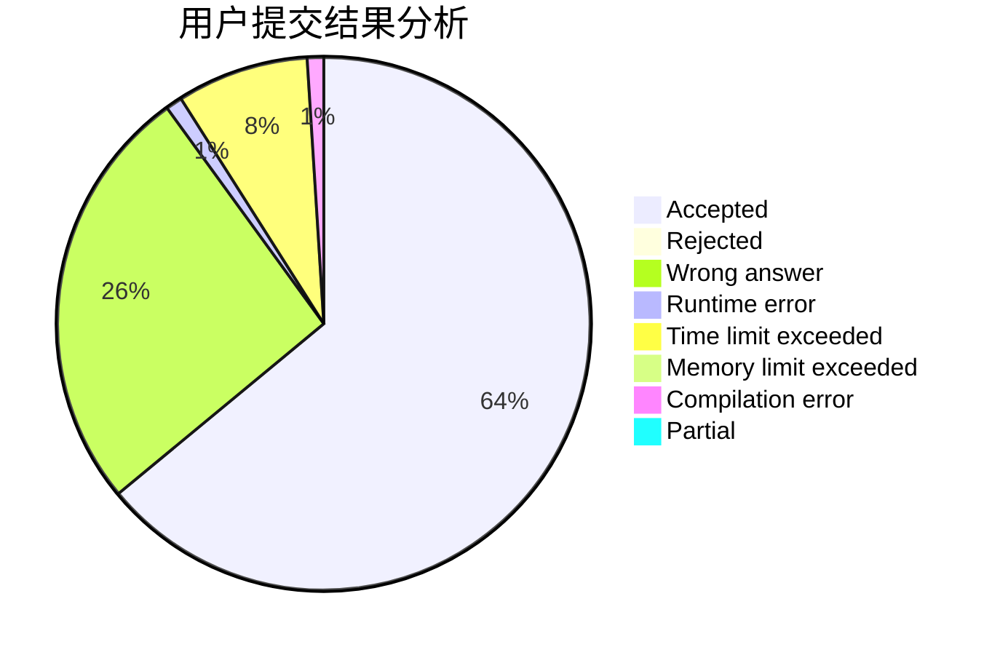
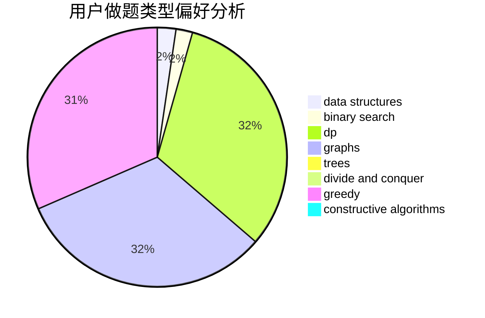
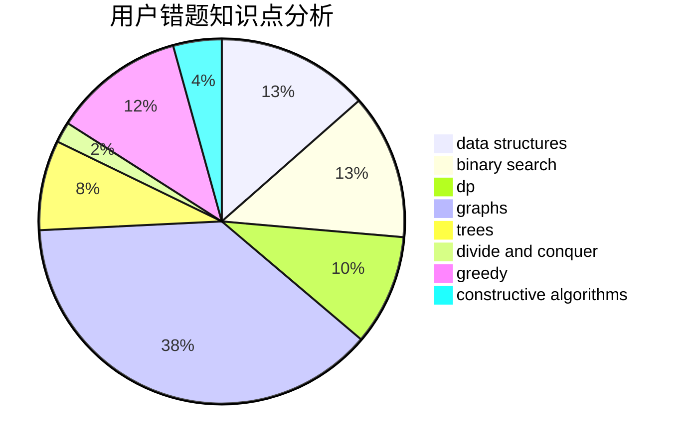

# smallguoguo

<!-- tabs:start -->

#### **用户提交结果分析**

#### **用户做题类型偏好分析**

#### **用户错题知识点分析**

<!-- tabs:end -->
# 推荐题目
[1137A](https://codeforces.com/contest/1137/problem/A)		implementation,
                        sortings		  
[224A](https://codeforces.com/contest/224/problem/A)		brute force,
                        geometry,
                        math		  
[203B](https://codeforces.com/contest/203/problem/B)		brute force,
                        implementation		  
[798A](https://codeforces.com/contest/798/problem/A)		brute force,
                        constructive algorithms,
                        strings		  
[923E](https://codeforces.com/contest/923/problem/E)		fft,
                        math,
                        matrices		  
[1358D](https://codeforces.com/contest/1358/problem/D)		binary search,
                        brute force,
                        greedy,
                        implementation,
                        two pointers		  
[516B](https://codeforces.com/contest/516/problem/B)		dsu,graphs,sortings,trees		  
[1107A](https://codeforces.com/contest/1107/problem/A)		greedy,
                        strings		  
[1368H1](https://codeforces.com/contest/1368H/problem/1)		dp,
                        flows,
                        greedy		  
[854A](https://codeforces.com/contest/854/problem/A)		brute force,
                        constructive algorithms,
                        math		  
