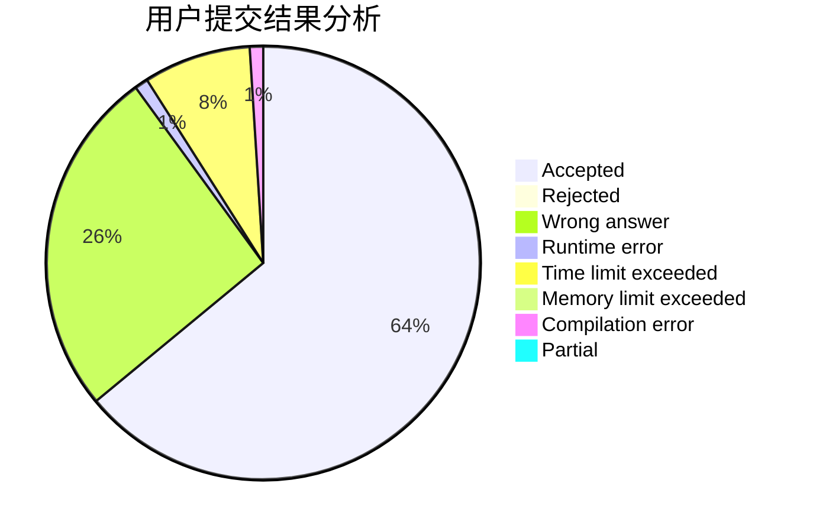
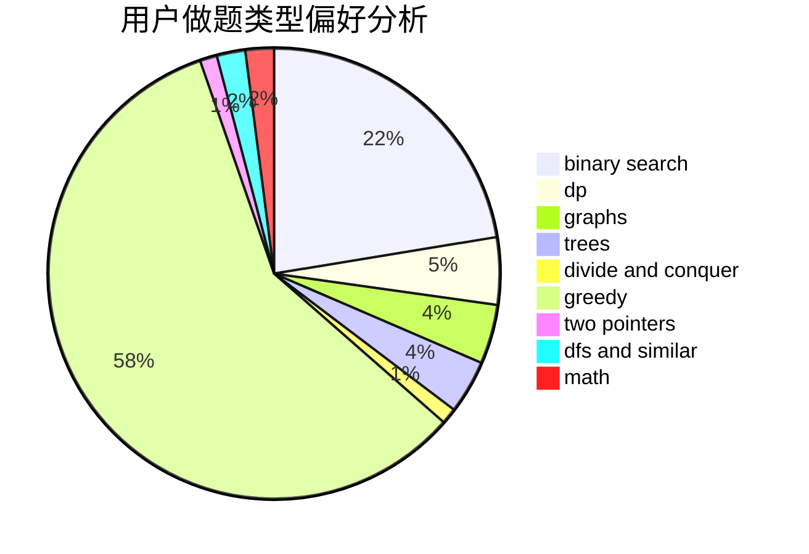

# smallguoguo

<!-- tabs:start -->

#### **用户提交结果分析**

#### **用户做题类型偏好分析**

<!-- tabs:end -->
# 推荐题目
[1139B](https://codeforces.com/contest/1139/problem/B)
[243A](https://codeforces.com/contest/243/problem/A)
[227A](https://codeforces.com/contest/227/problem/A)
[812A](https://codeforces.com/contest/812/problem/A)
[947C](https://codeforces.com/contest/947/problem/C)
[1366F](https://codeforces.com/contest/1366/problem/F)
[543B](https://codeforces.com/contest/543/problem/B)
[1107D](https://codeforces.com/contest/1107/problem/D)
[1375G](https://codeforces.com/contest/1375/problem/G)
[872B](https://codeforces.com/contest/872/problem/B)
