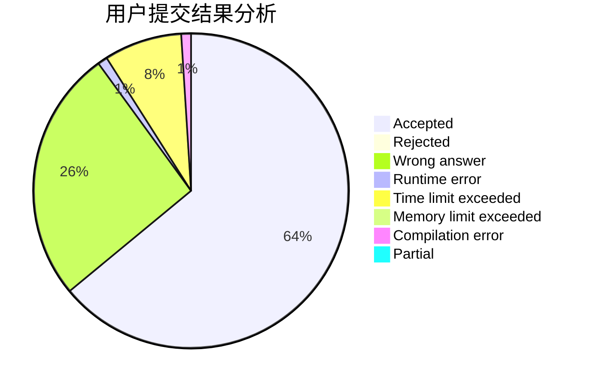
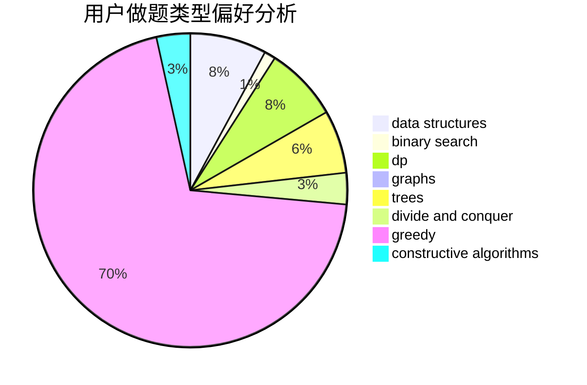
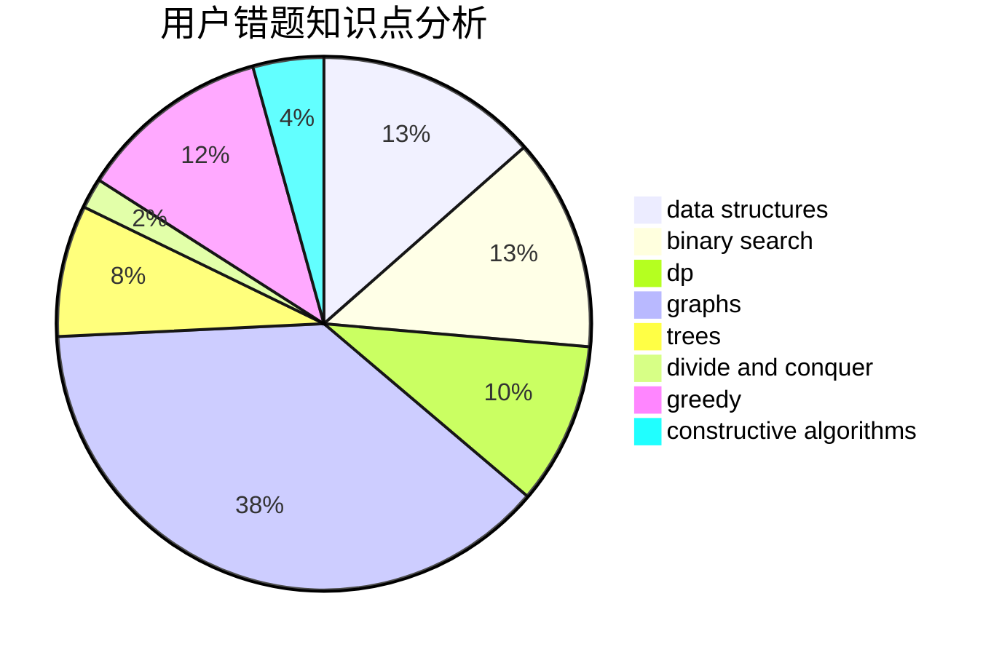

# smallguoguo

<!-- tabs:start -->

#### **用户提交结果分析**

#### **用户做题类型偏好分析**

#### **用户错题知识点分析**

<!-- tabs:end -->
# 推荐题目
[1139B](https://codeforces.com/contest/1139/problem/B)		greedy,
                        implementation		  
[243A](https://codeforces.com/contest/243/problem/A)		bitmasks		  
[227A](https://codeforces.com/contest/227/problem/A)		geometry		  
[812A](https://codeforces.com/contest/812/problem/A)		implementation		  
[947C](https://codeforces.com/contest/947/problem/C)		dsu,graphs,sortings,trees		  
[1366F](https://codeforces.com/contest/1366/problem/F)		binary search,
                        dp,
                        geometry,
                        graphs		  
[543B](https://codeforces.com/contest/543/problem/B)		constructive algorithms,
                        graphs,
                        shortest paths		  
[1107D](https://codeforces.com/contest/1107/problem/D)		dp,
                        implementation,
                        math,
                        number theory		  
[1375G](https://codeforces.com/contest/1375/problem/G)		brute force,
                        constructive algorithms,
                        dfs and similar,
                        graph matchings,
                        graphs,
                        trees		  
[872B](https://codeforces.com/contest/872/problem/B)		dsu,graphs,sortings,trees		  
