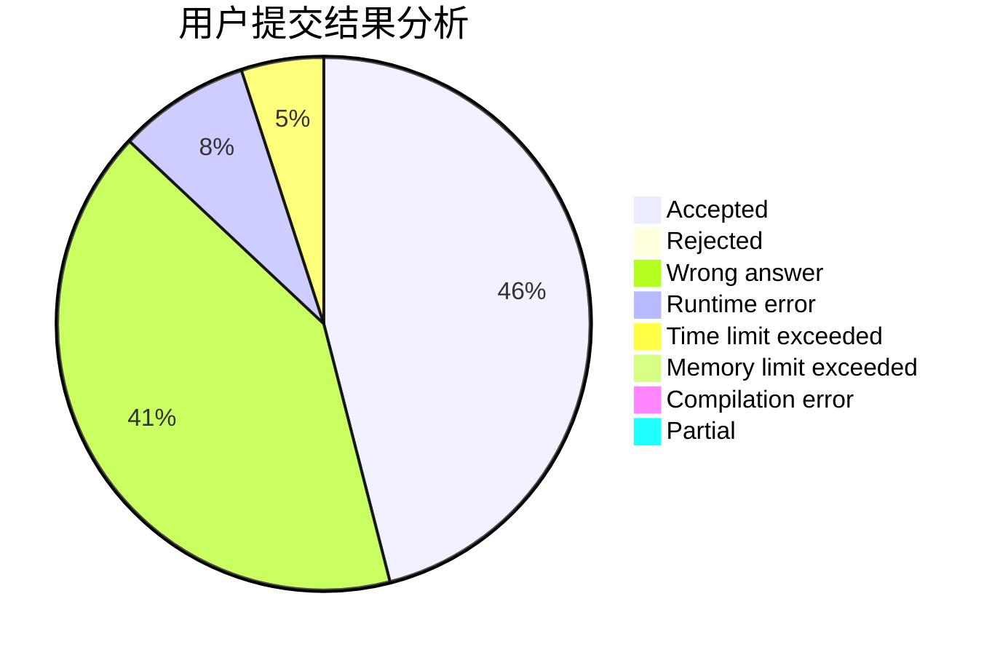
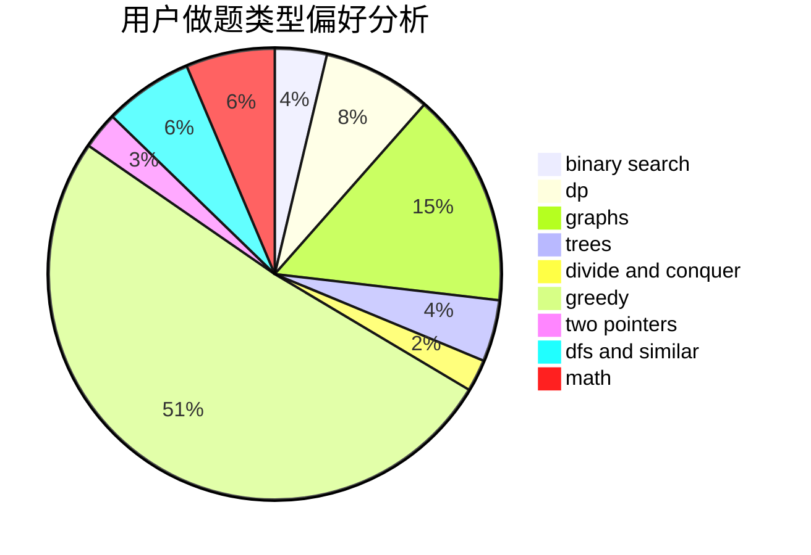

# smallling

<!-- tabs:start -->

#### **用户提交结果分析**

#### **用户做题类型偏好分析**

<!-- tabs:end -->
# 推荐题目
[627E](https://codeforces.com/contest/627/problem/E)
[1300C](https://codeforces.com/contest/1300/problem/C)
[13563](https://codeforces.com/contest/1356/problem/3)
[833C](https://codeforces.com/contest/833/problem/C)
[1091H](https://codeforces.com/contest/1091/problem/H)
[650C](https://codeforces.com/contest/650/problem/C)
[723D](https://codeforces.com/contest/723/problem/D)
[498B](https://codeforces.com/contest/498/problem/B)
[1186C](https://codeforces.com/contest/1186/problem/C)
[483C](https://codeforces.com/contest/483/problem/C)
