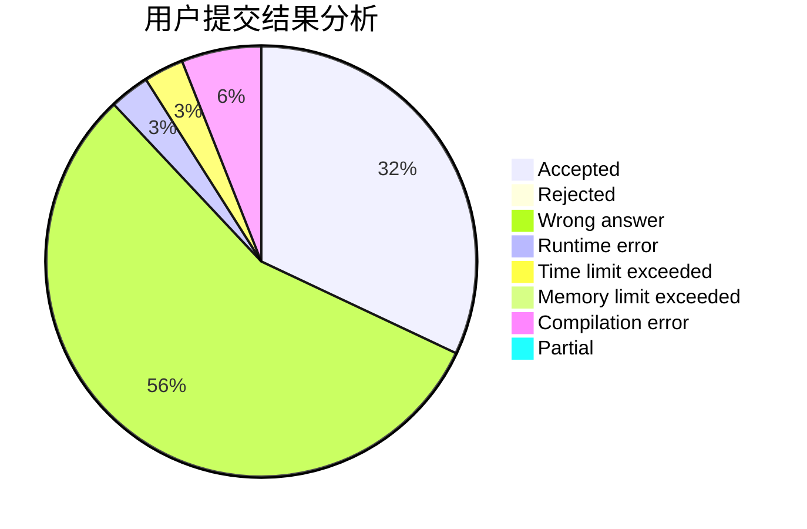
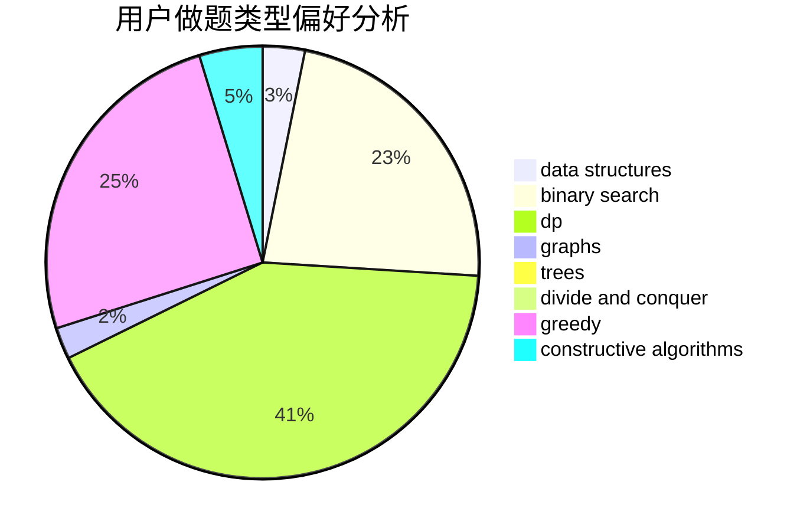
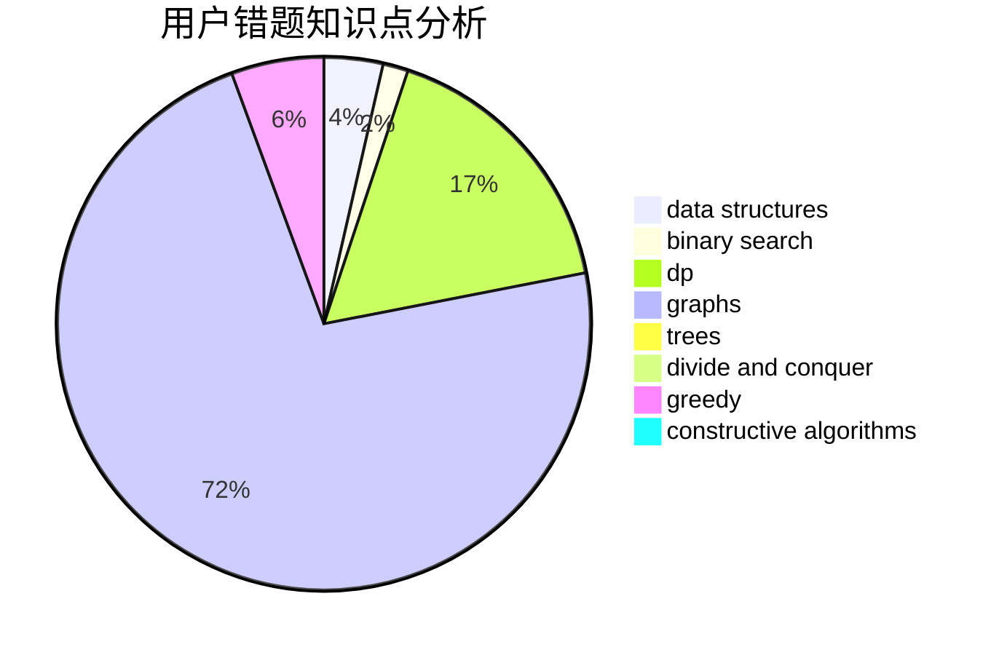

# smarthehe

<!-- tabs:start -->

#### **用户提交结果分析**

#### **用户做题类型偏好分析**

#### **用户错题知识点分析**

<!-- tabs:end -->
# 推荐题目
[80A](https://codeforces.com/contest/80/problem/A)		brute force		  
[577A](https://codeforces.com/contest/577/problem/A)		implementation,
                        number theory		  
[424B](https://codeforces.com/contest/424/problem/B)		binary search,
                        greedy,
                        implementation,
                        sortings		  
[121E](https://codeforces.com/contest/121/problem/E)		data structures		  
[478D](https://codeforces.com/contest/478/problem/D)		dp		  
[596A](https://codeforces.com/contest/596/problem/A)		geometry,
                        implementation		  
[918C](https://codeforces.com/contest/918/problem/C)		dsu,graphs,sortings,trees		  
[903B](https://codeforces.com/contest/903/problem/B)		greedy,
                        implementation		  
[1346F](https://codeforces.com/contest/1346/problem/F)		*special problem,
                        data structures,
                        greedy,
                        math		  
[1162C](https://codeforces.com/contest/1162/problem/C)		dsu,graphs,sortings,trees		  
