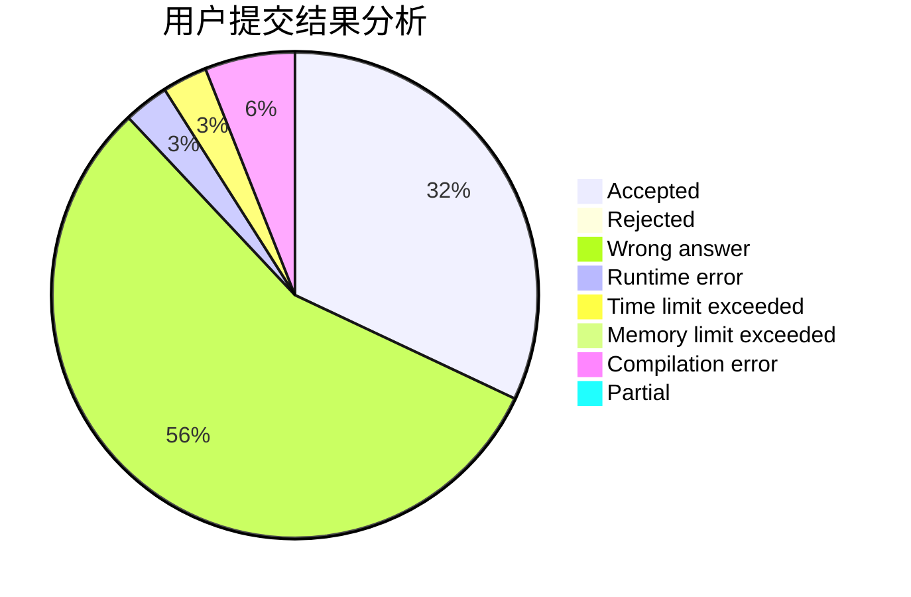
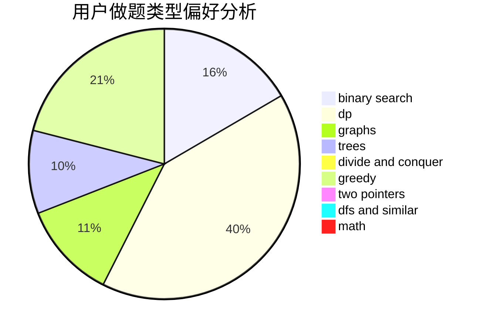

# smarthehe

<!-- tabs:start -->

#### **用户提交结果分析**

#### **用户做题类型偏好分析**

<!-- tabs:end -->
# 推荐题目
[80A](https://codeforces.com/contest/80/problem/A)
[577A](https://codeforces.com/contest/577/problem/A)
[424B](https://codeforces.com/contest/424/problem/B)
[121E](https://codeforces.com/contest/121/problem/E)
[478D](https://codeforces.com/contest/478/problem/D)
[596A](https://codeforces.com/contest/596/problem/A)
[918C](https://codeforces.com/contest/918/problem/C)
[903B](https://codeforces.com/contest/903/problem/B)
[1346F](https://codeforces.com/contest/1346/problem/F)
[1162C](https://codeforces.com/contest/1162/problem/C)
