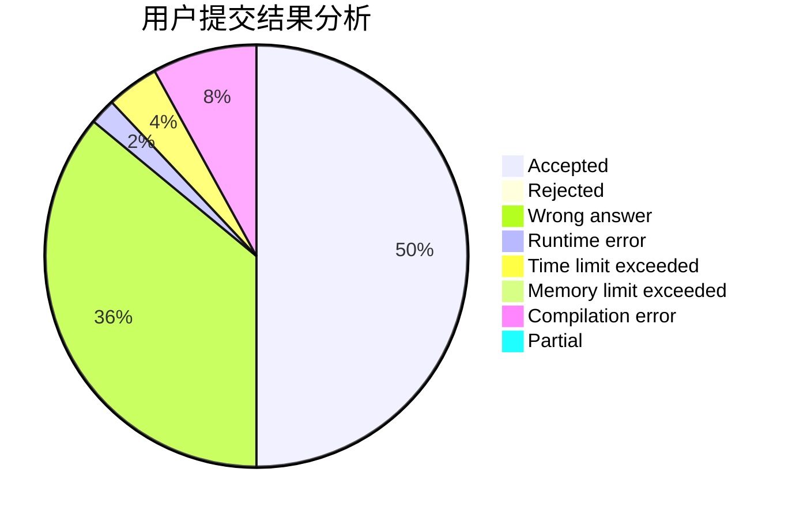
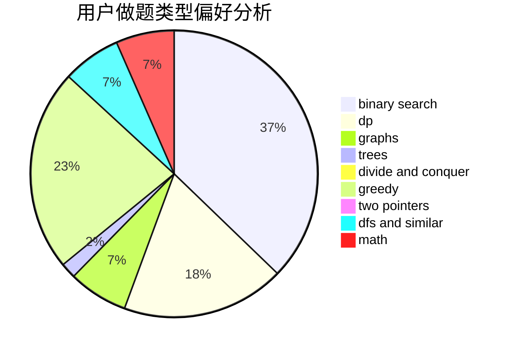

# smg23333

<!-- tabs:start -->

#### **用户提交结果分析**

#### **用户做题类型偏好分析**

<!-- tabs:end -->
# 推荐题目
[763A](https://codeforces.com/contest/763/problem/A)
[1267I](https://codeforces.com/contest/1267/problem/I)
[1133A](https://codeforces.com/contest/1133/problem/A)
[760A](https://codeforces.com/contest/760/problem/A)
[1070E](https://codeforces.com/contest/1070/problem/E)
[414E](https://codeforces.com/contest/414/problem/E)
[418C](https://codeforces.com/contest/418/problem/C)
[864E](https://codeforces.com/contest/864/problem/E)
[1342F](https://codeforces.com/contest/1342/problem/F)
[1185F](https://codeforces.com/contest/1185/problem/F)
