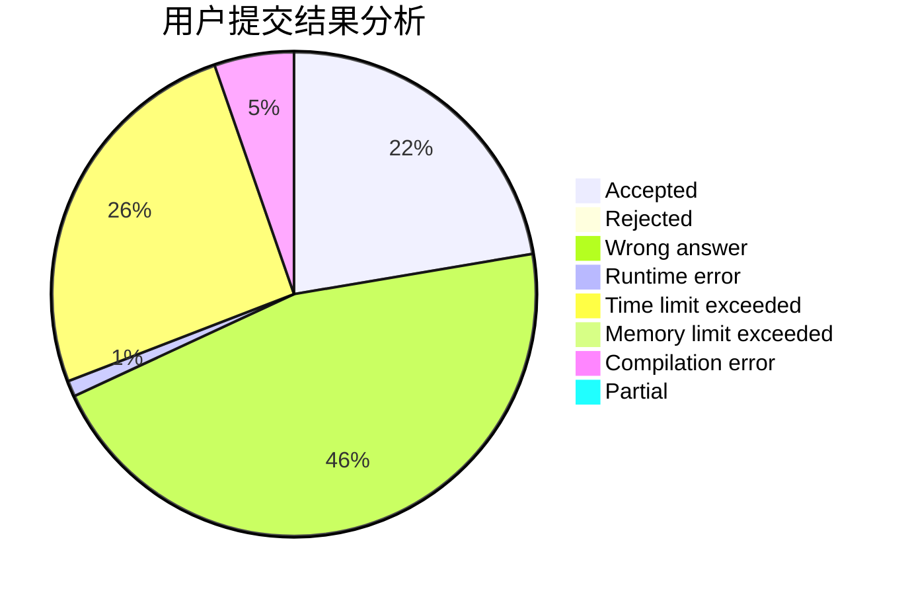
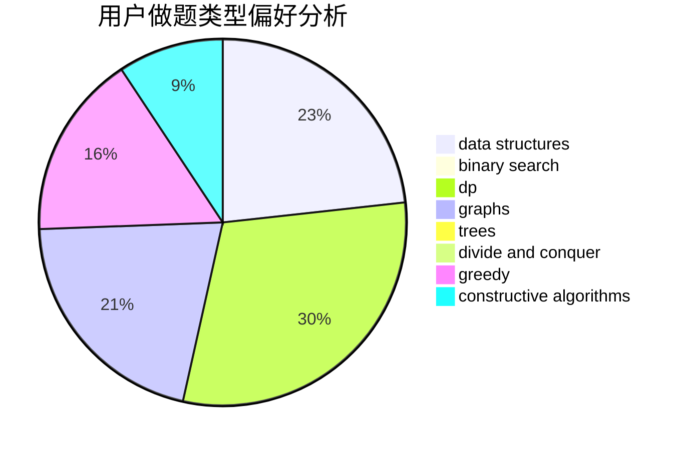

# smilingface

<!-- tabs:start -->

#### **用户提交结果分析**

#### **用户做题类型偏好分析**

#### **用户错题知识点分析**

<!-- tabs:end -->
# 推荐题目
[1182C](https://codeforces.com/contest/1182/problem/C)		data structures,
                        greedy,
                        strings		  
[906A](https://codeforces.com/contest/906/problem/A)		implementation,
                        strings		  
[253A](https://codeforces.com/contest/253/problem/A)		greedy		  
[669C](https://codeforces.com/contest/669/problem/C)		dsu,graphs,sortings,trees		  
[585C](https://codeforces.com/contest/585/problem/C)		number theory		  
[582B](https://codeforces.com/contest/582/problem/B)		constructive algorithms,
                        dp,
                        matrices		  
[1009A](https://codeforces.com/contest/1009/problem/A)		implementation		  
[118A](https://codeforces.com/contest/118/problem/A)		implementation,
                        strings		  
[1148G](https://codeforces.com/contest/1148/problem/G)		constructive algorithms,
                        graphs,
                        math,
                        number theory,
                        probabilities		  
[686B](https://codeforces.com/contest/686/problem/B)		constructive algorithms,
                        implementation,
                        sortings		  
