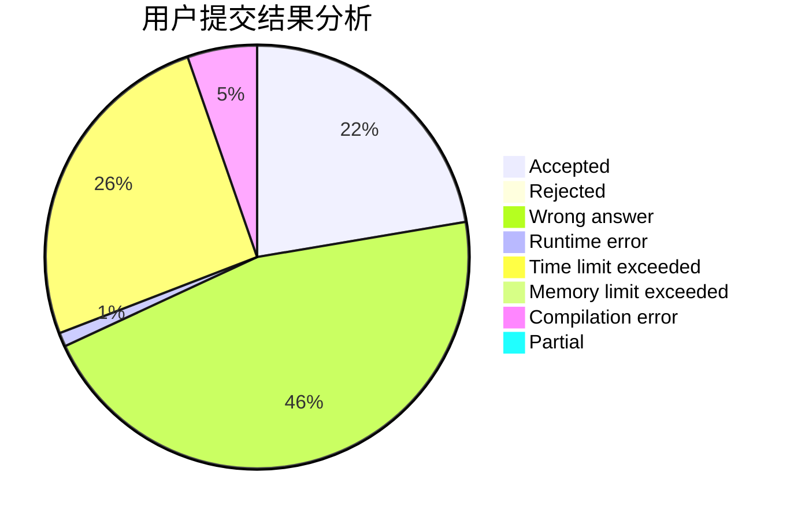
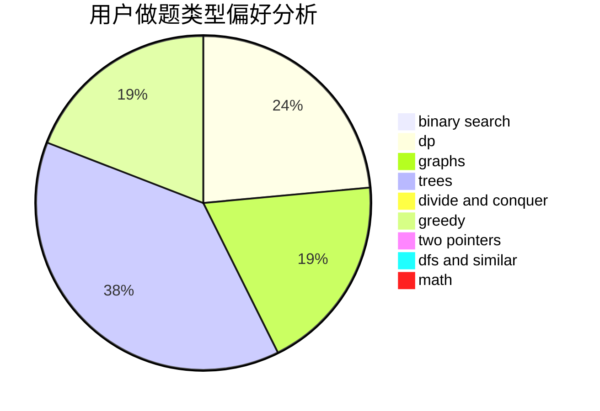

# smilingface

<!-- tabs:start -->

#### **用户提交结果分析**

#### **用户做题类型偏好分析**

<!-- tabs:end -->
# 推荐题目
[1182C](https://codeforces.com/contest/1182/problem/C)
[906A](https://codeforces.com/contest/906/problem/A)
[253A](https://codeforces.com/contest/253/problem/A)
[669C](https://codeforces.com/contest/669/problem/C)
[585C](https://codeforces.com/contest/585/problem/C)
[582B](https://codeforces.com/contest/582/problem/B)
[1009A](https://codeforces.com/contest/1009/problem/A)
[118A](https://codeforces.com/contest/118/problem/A)
[1148G](https://codeforces.com/contest/1148/problem/G)
[686B](https://codeforces.com/contest/686/problem/B)
