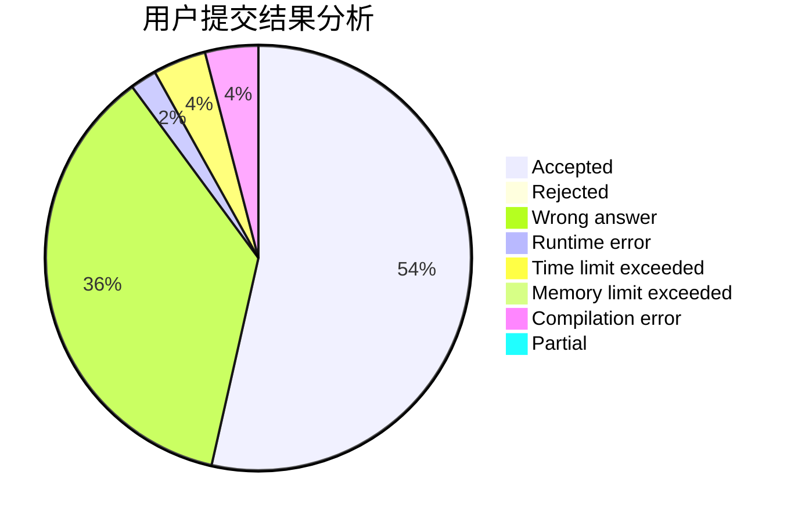
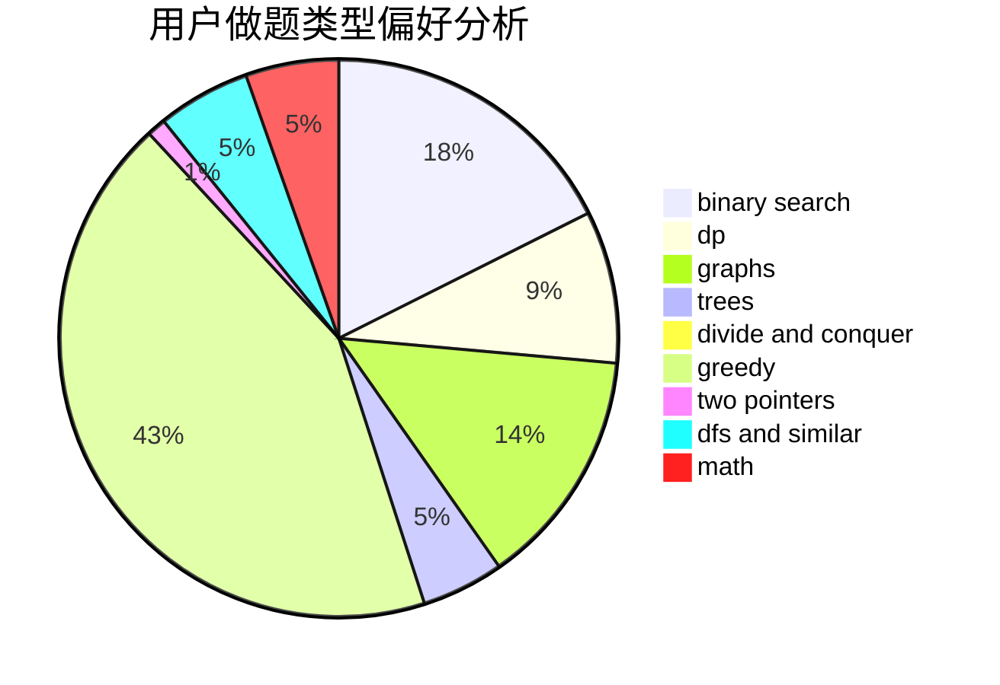

# smzzl

<!-- tabs:start -->

#### **用户提交结果分析**

#### **用户做题类型偏好分析**

<!-- tabs:end -->
# 推荐题目
[1353B](https://codeforces.com/contest/1353/problem/B)
[729E](https://codeforces.com/contest/729/problem/E)
[624A](https://codeforces.com/contest/624/problem/A)
[122C](https://codeforces.com/contest/122/problem/C)
[33C](https://codeforces.com/contest/33/problem/C)
[462E](https://codeforces.com/contest/462/problem/E)
[740D](https://codeforces.com/contest/740/problem/D)
[628B](https://codeforces.com/contest/628/problem/B)
[902C](https://codeforces.com/contest/902/problem/C)
[960E](https://codeforces.com/contest/960/problem/E)
