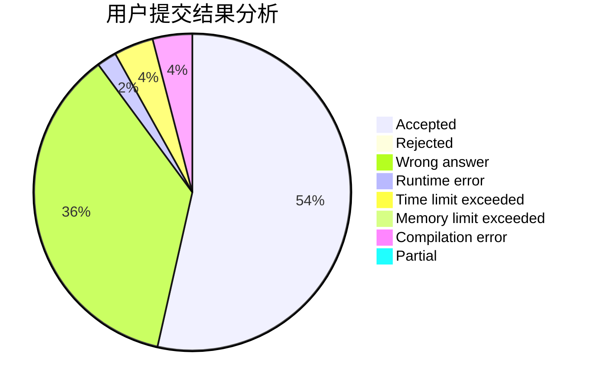
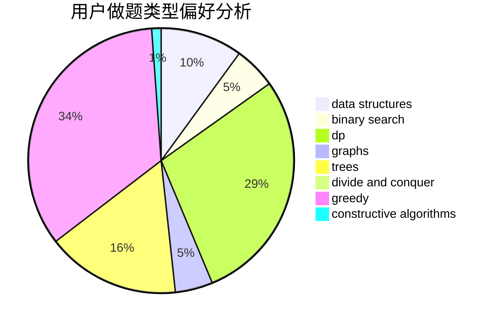
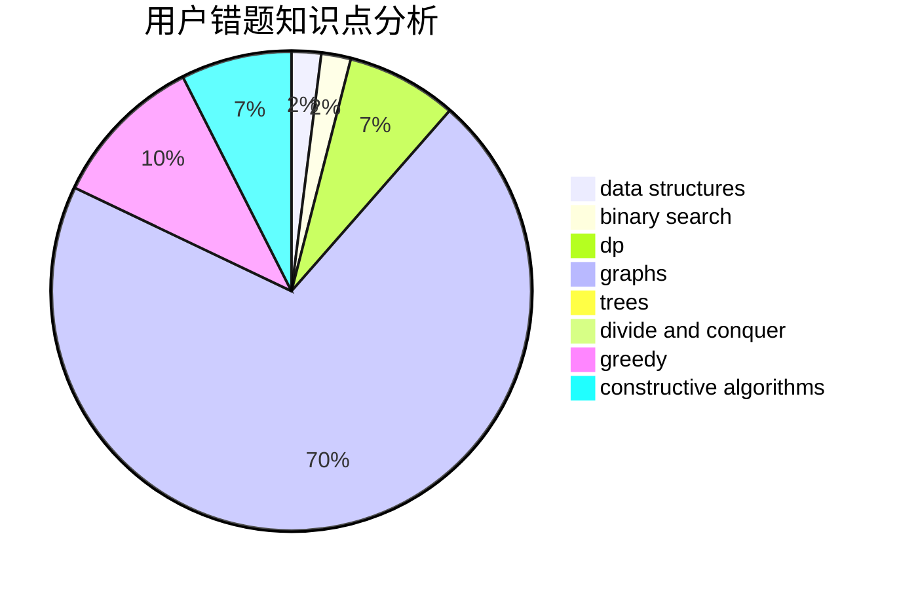

# smzzl

<!-- tabs:start -->

#### **用户提交结果分析**

#### **用户做题类型偏好分析**

#### **用户错题知识点分析**

<!-- tabs:end -->
# 推荐题目
[1353B](https://codeforces.com/contest/1353/problem/B)		greedy,
                        sortings		  
[729E](https://codeforces.com/contest/729/problem/E)		constructive algorithms,
                        data structures,
                        graphs,
                        greedy,
                        sortings		  
[624A](https://codeforces.com/contest/624/problem/A)		math		  
[122C](https://codeforces.com/contest/122/problem/C)		dsu,graphs,sortings,trees		  
[33C](https://codeforces.com/contest/33/problem/C)		greedy		  
[462E](https://codeforces.com/contest/462/problem/E)		dsu,graphs,sortings,trees		  
[740D](https://codeforces.com/contest/740/problem/D)		dsu,graphs,sortings,trees		  
[628B](https://codeforces.com/contest/628/problem/B)		dp		  
[902C](https://codeforces.com/contest/902/problem/C)		dsu,graphs,sortings,trees		  
[960E](https://codeforces.com/contest/960/problem/E)		combinatorics,
                        dfs and similar,
                        divide and conquer,
                        dp,
                        probabilities,
                        trees		  
