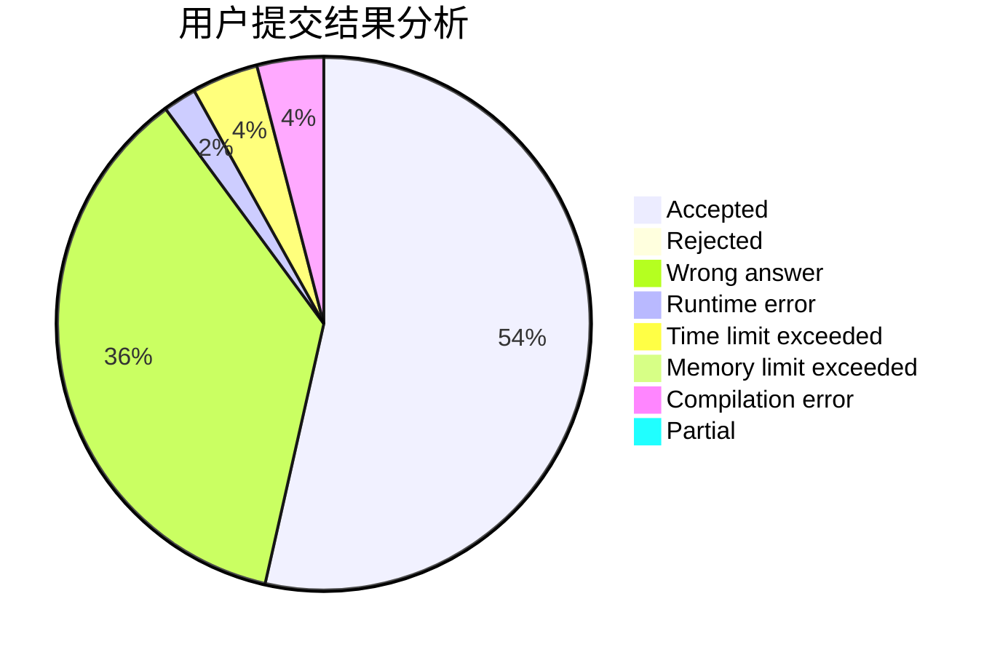
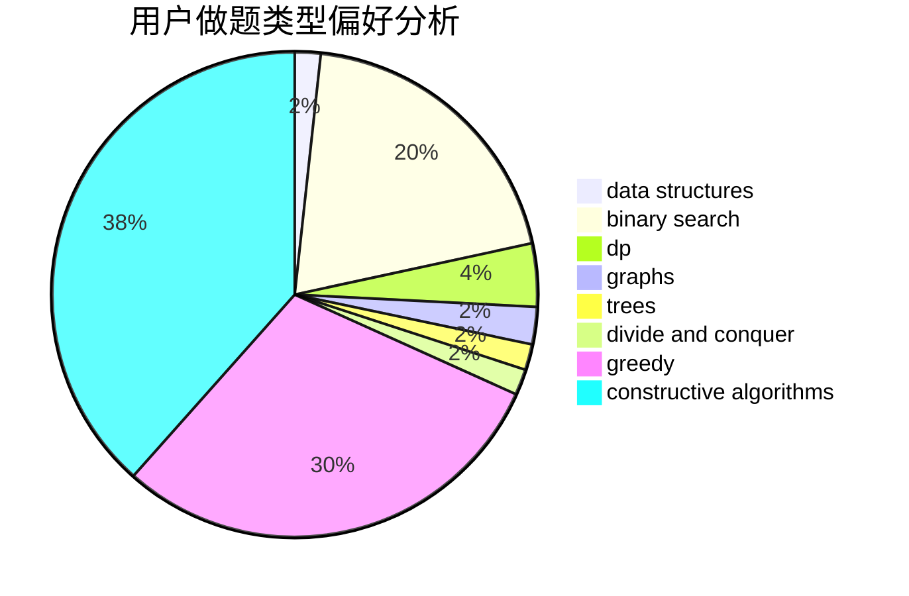
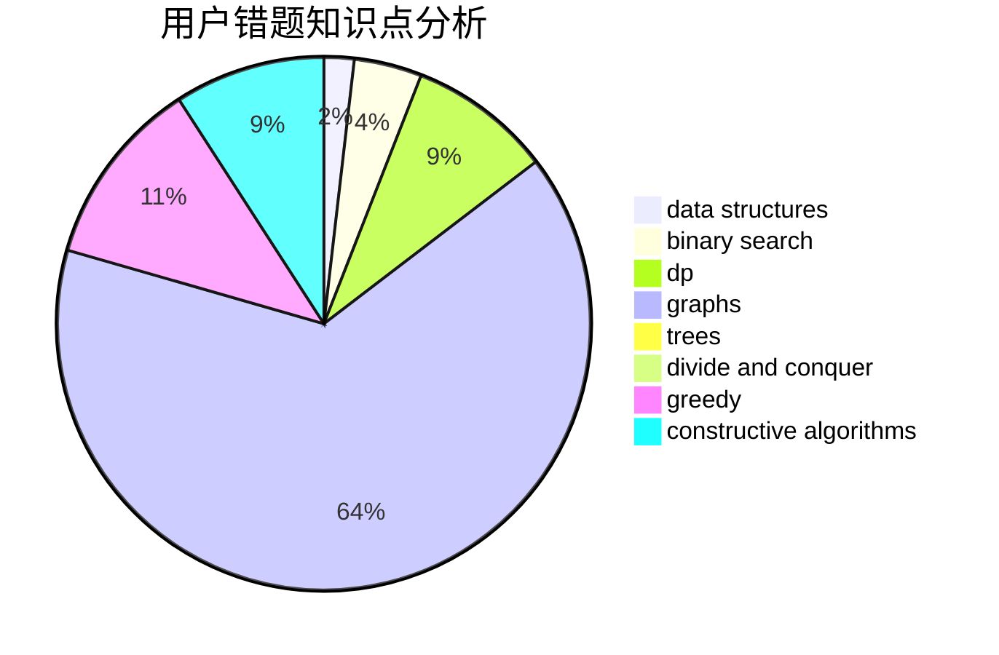

# smzzl

<!-- tabs:start -->

#### **用户提交结果分析**

#### **用户做题类型偏好分析**

#### **用户错题知识点分析**

<!-- tabs:end -->
# 推荐题目
[1346A](https://codeforces.com/contest/1346/problem/A)		*special problem,
                        math		  
[709D](https://codeforces.com/contest/709/problem/D)		dsu,graphs,sortings,trees		  
[606A](https://codeforces.com/contest/606/problem/A)		implementation		  
[1221G](https://codeforces.com/contest/1221/problem/G)		bitmasks,
                        brute force,
                        combinatorics,
                        dp,
                        meet-in-the-middle		  
[316B1](https://codeforces.com/contest/316B/problem/1)		brute force,
                        dfs and similar		  
[442B](https://codeforces.com/contest/442/problem/B)		greedy,
                        math,
                        probabilities		  
[723C](https://codeforces.com/contest/723/problem/C)		greedy		  
[609B](https://codeforces.com/contest/609/problem/B)		constructive algorithms,
                        implementation		  
[884B](https://codeforces.com/contest/884/problem/B)		implementation		  
[939B](https://codeforces.com/contest/939/problem/B)		implementation		  
