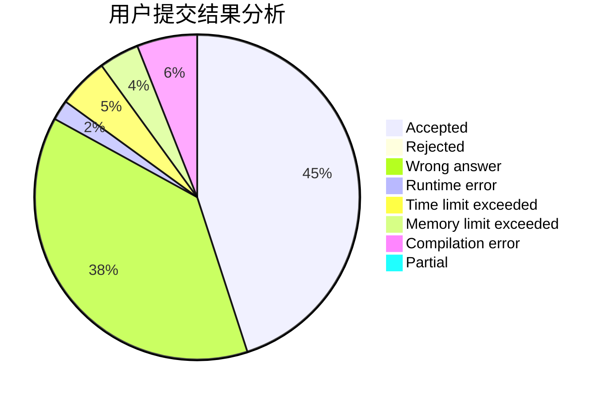
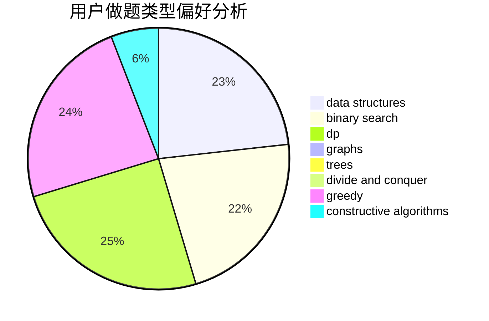
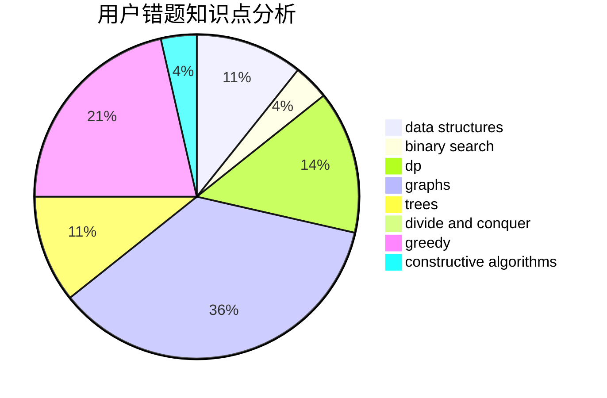

# CJSHP

<!-- tabs:start -->

#### **用户提交结果分析**

#### **用户做题类型偏好分析**

#### **用户错题知识点分析**

<!-- tabs:end -->
# 推荐题目
[600F](https://codeforces.com/contest/600/problem/F)		graphs		  
[1244D](https://codeforces.com/contest/1244/problem/D)		brute force,
                        constructive algorithms,
                        dp,
                        graphs,
                        implementation,
                        trees		  
[1457E](https://codeforces.com/contest/1457/problem/E)		dsu,graphs,sortings,trees		  
[358B](https://codeforces.com/contest/358/problem/B)		brute force,
                        strings		  
[1119E](https://codeforces.com/contest/1119/problem/E)		brute force,
                        dp,
                        fft,
                        greedy,
                        ternary search		  
[1196D1](https://codeforces.com/contest/1196D/problem/1)		implementation		  
[1002C2](https://codeforces.com/contest/1002C/problem/2)		nan		  
[1286C2](https://codeforces.com/contest/1286C/problem/2)		brute force,
                        constructive algorithms,
                        hashing,
                        interactive,
                        math		  
[1473E](https://codeforces.com/contest/1473/problem/E)		graphs,
                        shortest paths		  
[1191D](https://codeforces.com/contest/1191/problem/D)		dsu,graphs,sortings,trees		  
