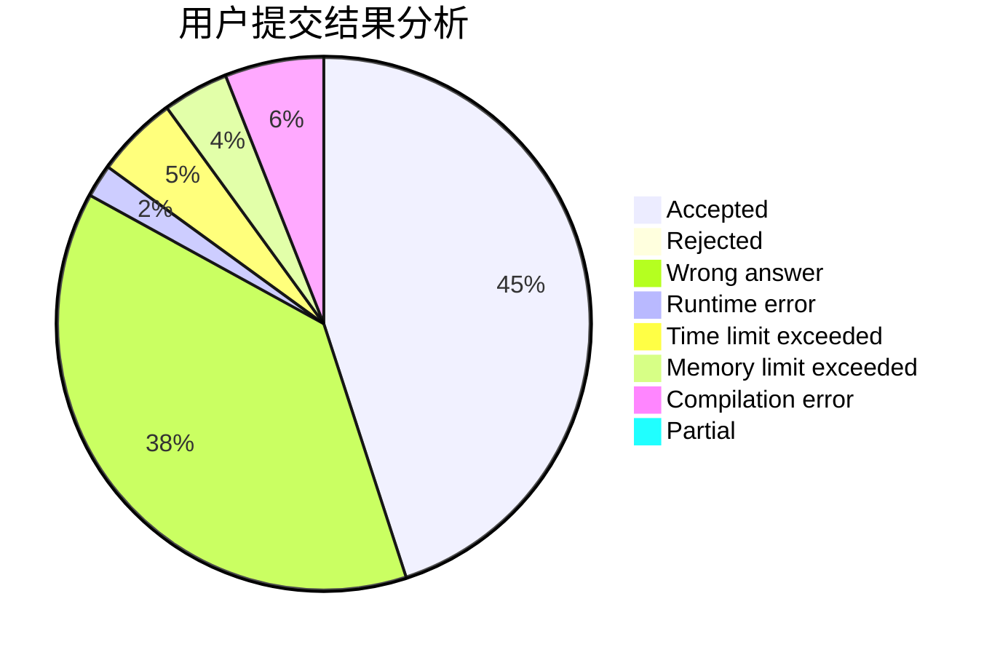
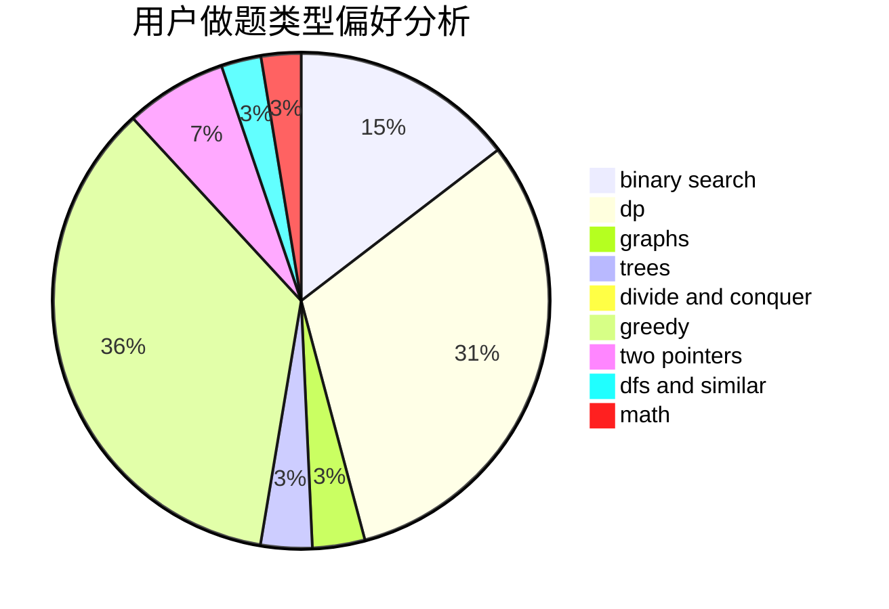

# CJSHP

<!-- tabs:start -->

#### **用户提交结果分析**

#### **用户做题类型偏好分析**

<!-- tabs:end -->
# 推荐题目
[620B](https://codeforces.com/contest/620/problem/B)
[1249F](https://codeforces.com/contest/1249/problem/F)
[1466H](https://codeforces.com/contest/1466/problem/H)
[383D](https://codeforces.com/contest/383/problem/D)
[11292](https://codeforces.com/contest/1129/problem/2)
[11E](https://codeforces.com/contest/11/problem/E)
[10024](https://codeforces.com/contest/1002/problem/4)
[1293E](https://codeforces.com/contest/1293/problem/E)
[1482B](https://codeforces.com/contest/1482/problem/B)
[1197C](https://codeforces.com/contest/1197/problem/C)
